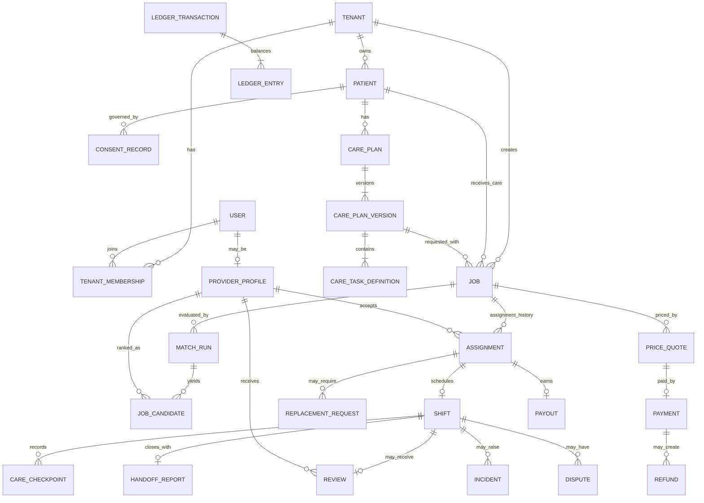
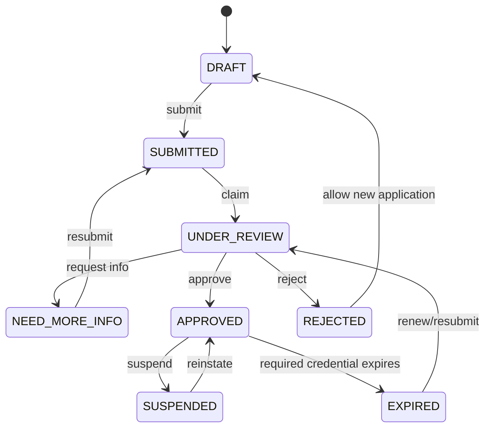
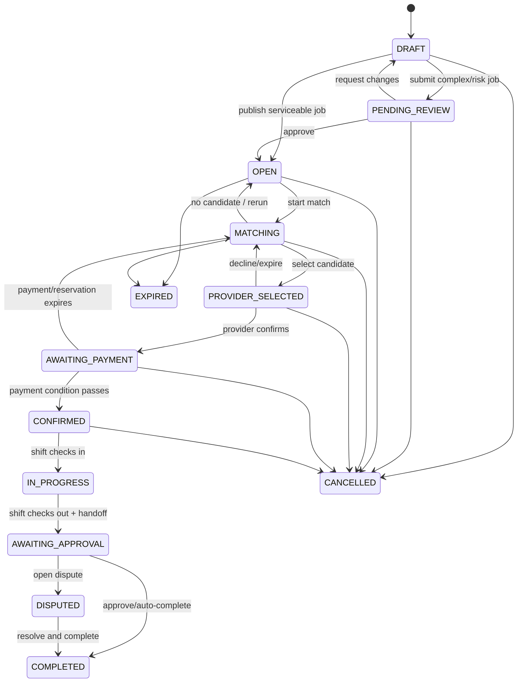
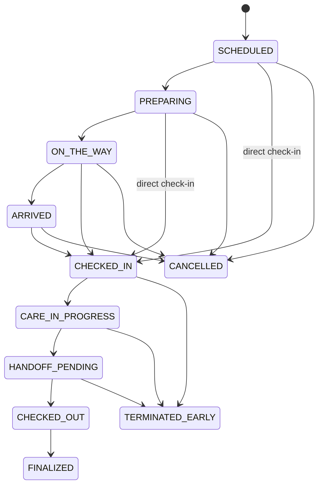
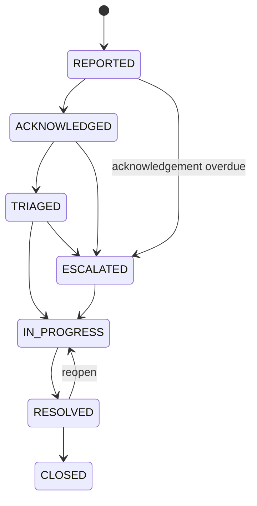

# Carespaces — Domain Model, State Machines & Permissions (P03)

> สถานะ: Draft normative baseline สำหรับ schema, API contract และ automated tests
>
> วันที่: 13 กรกฎาคม 2026
>
> อ้างอิง: `idea.md`, `p01-design.md` และ `p02-mvp-spec.md`

## 1. วัตถุประสงค์และขอบเขต

เอกสารนี้กำหนดภาษากลางของระบบระดับ domain สำหรับ MVP ได้แก่:

- ขอบเขตความเป็นเจ้าของข้อมูลของแต่ละ module
- Entity, relationship และ invariant ที่ห้ามละเมิด
- State machine และ transition guard ที่เป็น normative
- Permission matrix แบบ RBAC + ABAC
- Domain event, command และ idempotency boundary
- กติกา concurrency, correction, audit และ data lifecycle

ชื่อ entity, state และ event ในเอกสารนี้ใช้เป็น baseline ของ database schema, OpenAPI, mobile sync, admin workflow และ automated test หาก implementation ต้องเปลี่ยน ต้องบันทึก ADR และอัปเดต traceability ก่อน merge

## 2. Modeling conventions

### 2.1 Identity และ key

- Public aggregate ID ใช้ UUIDv7 หรือ ULID รูปแบบเดียวทั้งระบบ
- Foreign key ภายในฐานข้อมูลต้อง enforce referential integrity ยกเว้น immutable external reference
- ทุก tenant-owned entity มี `tenant_id`
- B2C MVP ใช้ `Tenant(type=FAMILY)` หนึ่งรายการต่อ family workspace แม้มีสมาชิกเพียงคนเดียว
- External provider ID เช่น PSP event/payment ID ต้องมี unique constraint ตาม provider
- Mobile mutation ทุกคำสั่งที่ retry ได้ต้องมี `client_event_id`; financial command ใช้ `idempotency_key`

### 2.2 Time และ money

- Timestamp เก็บเป็น UTC และเก็บ IANA timezone ของ Job/Shift แยกต่างหาก
- เวลาที่มีผลต่อ SLA/expiry ใช้ server time เป็นหลัก
- เงินใช้ integer minor unit + ISO 4217 currency ห้ามใช้ floating point
- Rate, quote, policy และ Care Plan ต้องอ้าง version ที่ immutable หลัง publish/activate

### 2.3 Mutation rules

- ทุก state transition ผ่าน aggregate/domain service ห้าม update `status` โดยตรง
- Transition สำเร็จต้องเขียน state, `StateTransition`, audit metadata และ `OutboxEvent` ใน transaction เดียวกัน
- Clinical, financial และ audit record ใช้ append/correct/reverse ไม่ overwrite ประวัติเดิม
- Optimistic concurrency ใช้ `version` integer หรือ compare-and-swap กับ expected state/version
- API command ที่เปลี่ยน state ต้องรับ expected version เมื่อ concurrent update มีผลต่อผลลัพธ์

### 2.4 Naming

- Database/API state ใช้ `UPPER_SNAKE_CASE`
- Command ใช้ imperative เช่น `ConfirmAssignment`
- Domain event ใช้ past tense และมี version เช่น `assignment.confirmed.v1`
- เหตุผลที่ระบบ/เจ้าหน้าที่ใช้ต้องเป็น versioned reason code; free-text note ใช้เสริม ไม่ใช้แทน reason code

## 3. Domain boundaries และ ownership

| Module | Aggregate roots | เป็นเจ้าของข้อมูล | ห้าม module อื่นแก้โดยตรง |
|---|---|---|---|
| Identity & Access | `Tenant`, `User`, `RoleAssignment`, `AccessGrant` | identity mapping, tenant membership, role/capability, patient access | role, membership, grant status |
| Patient & Consent | `Patient`, `ConsentRecord` | patient profile, relationship, authority/legal basis, emergency contact | patient/consent status |
| Provider Verification | `ProviderProfile`, `VerificationCase`, `Credential` | provider type, verification decision, credential, skill qualification | approval/suspension/credential status |
| Care Planning | `CarePlan`, `CarePlanVersion` | versioned plan, task definition, clinical review | published plan version/task rule |
| Marketplace | `Job`, `MatchRun`, `JobCandidate` | job requirement, serviceability, candidate snapshot, selection | job/candidate lifecycle |
| Scheduling | `Assignment`, `Shift`, `AvailabilitySlot` | reservation, assignment contract, schedule conflict, shift execution | reservation/assignment/shift state |
| Care Records | `CareRecord`, `CareCheckpoint`, `HandoffReport` | observation, checkpoint, medication confirmation, correction | submitted care record |
| Safety | `Incident`, `ReplacementRequest` | incident timeline, escalation, replacement saga | severity/outcome/replacement state |
| Payments | `PriceQuote`, `Payment`, `Payout`, `Refund`, `LedgerTransaction`, `Dispute` | price snapshot, PSP orchestration, ledger, dispute hold/decision | financial state/entries |
| Reputation | `Review` | customer review, moderation state, public aggregates, internal score snapshots | review/moderation state |
| Operations | `OpsTask`, `Notification`, `Acknowledgement`, `ManualOverride` | work queue, escalation clock, delivery/acknowledgement, override | task/ack/override state |
| Platform | `InboxMessage`, `OutboxEvent`, `ScheduledDeadline`, `AuditEvent` | integration deduplication, reliable events, timers, immutable audit | processing/audit status |

การอ่านข้าม module ทำผ่าน application query/service หรือ read model การเปลี่ยนข้อมูลข้าม aggregate ใช้ command + domain event/saga ไม่ใช้ transaction ขนาดใหญ่โดยไม่มี invariant ที่ต้อง atomic จริง

## 4. Entity model

### 4.1 Relationship overview



Diagram แสดงความสัมพันธ์หลัก ไม่ได้แทน schema เต็ม Entity ที่เป็นประวัติ เช่น audit, transition, inbox/outbox และ notification เชื่อมด้วย polymorphic subject reference ที่ควบคุมชนิดได้

### 4.2 Identity & access

#### `Tenant`

| Field | Rule |
|---|---|
| `id`, `type`, `status` | MVP ใช้ `FAMILY`; เตรียม enum สำหรับ `ORGANIZATION` แต่ยังไม่เปิด flow B2B |
| `display_name` | ชื่อ workspace/family ที่ไม่ใช่ Patient identity โดยอัตโนมัติ |
| `created_by_user_id` | actor ผู้สร้างและต้องเป็น membership แรก |

#### `TenantMembership`

- Unique `(tenant_id, user_id)` สำหรับ membership ที่ active
- เก็บ status, invited/accepted timestamps และ relationship label
- Membership ไม่ให้สิทธิ์อ่าน Patient ทุกคนโดยอัตโนมัติ; ต้องมี `PatientAccessGrant`

#### `RoleAssignment`

- Scope เป็น `PLATFORM`, `TENANT` หรือ resource ที่อนุมัติ
- เก็บ role, effective/expiry time และ granted/revoked actor
- Platform role ต้องมี MFA claim และ privileged session ตาม policy

#### `PatientAccessGrant`

- เชื่อม `user_id`, `patient_id`, capability set, legal basis/consent reference และ expiry
- Default deny เมื่อไม่มี grant ที่ active
- Revocation มีผลกับ request ใหม่ทันที แต่ไม่ลบ audit/history

### 4.3 Patient & consent

#### `Patient`

- เป็น aggregate root แยกจาก `User`; Patient ไม่จำเป็นต้องมีบัญชี
- เก็บ demographic/care data ขั้นต่ำและ sensitivity classification
- Exact address แยกเป็น protected location record และใช้ coarse location ใน matching เมื่อทำได้
- Status: `ACTIVE`, `INACTIVE`, `RESTRICTED`, `ARCHIVED`; archive ไม่ลบ clinical/financial history

#### `PatientContact`

- ประเภท `PRIMARY`, `EMERGENCY`, `AUTHORIZED_REPRESENTATIVE`
- เก็บ priority, communication channel และเวลาที่ควรติดต่อ
- Emergency contact ต้องมีอย่างน้อยหนึ่งรายก่อน Job publish

#### `ConsentRecord`

- Immutable version ต่อการให้/ถอน/หมดอายุหนึ่งเหตุการณ์
- เก็บ subject, giver, relationship, authority evidence, purpose/scope, notice version, legal basis, effective/expiry time
- สถานะ derived จาก event history: `ACTIVE`, `WITHDRAWN`, `EXPIRED`, `SUPERSEDED`
- Job publish guard ต้องมี consent/authority ที่ active และครอบคลุม care coordination/data sharing

### 4.4 Provider verification

#### `ProviderProfile`

- หนึ่ง profile ต่อ `User` ใน MVP
- เก็บ provider type, service area, bio, experience summary, public visibility และ verification-derived status
- `approval_status` เปลี่ยนผ่าน Verification workflow เท่านั้น
- Payout onboarding status แยกจาก approval; provider อาจ approved แต่รับ Assignment ใหม่ไม่ได้หาก policy บังคับ payout readiness

#### `VerificationCase`

- หนึ่ง active case ต่อ provider ต่อ verification purpose
- เก็บ submitted snapshot, checklist version, reviewer, decision reason และ evidence references
- การ resubmit หลัง `NEED_MORE_INFO` สร้าง submission revision ไม่ทับเอกสารเดิม

#### `Credential`

- เก็บ type, issuer, masked identifier, issue/expiry, encrypted document reference และ verification status
- เลขที่ที่ต้อง exact match ใช้ encrypted value + keyed hash
- Expiry worker สร้าง deadline/event; status ของ Provider คำนวณร่วมกับ credential requirements

#### `ProviderSkill`

- เชื่อม skill, proficiency/evidence, verified_by และ expiry ถ้ามี
- Self-declared skill ไม่ผ่าน hard gate ที่ต้อง verified skill
- Policy version เป็นผู้กำหนดว่า provider type + skill + credential ทำ activity ใดได้

#### `AvailabilitySlot`

- เก็บ interval, timezone, recurrence source เฉพาะการกรอก availability; MVP Assignment ยังคงเป็นหนึ่งกะ
- Availability ไม่ใช่การจอง; confirmed/reserved Assignment เป็นตัวบล็อกเวลาจริง
- Interval overlap check ต้องทำ atomic ใน Scheduling module

### 4.5 Care planning

#### `CarePlan`

- Container ระยะยาวของ Patient มี status `ACTIVE` หรือ `ARCHIVED`
- มี draft version ได้หนึ่งรายการต่อ editing branch ใน MVP

#### `CarePlanVersion`

- Status: `DRAFT`, `PENDING_CLINICAL_REVIEW`, `PUBLISHED`, `SUPERSEDED`, `REJECTED`
- เมื่อ `PUBLISHED` แล้ว content immutable
- เก็บ source, author, reviewer, change reason, effective time และ risk classification
- Version ใหม่ไม่ repin Job/Shift ที่ confirmed หรือเริ่มแล้วโดยอัตโนมัติ

#### `CareTaskDefinition`

- เก็บ activity code, instruction, timing/trigger, mandatory/conditional, evidence type และ escalation rule
- เก็บ minimum provider type/qualification และ restricted activity reference
- Medication task อ้าง prescribed instruction ที่ Customer/authorized source ให้มา ระบบไม่สร้างคำสั่งรักษาเอง

### 4.6 Marketplace & scheduling

#### `Job`

- MVP หนึ่ง Job อ้าง Patient หนึ่งราย, Care Plan version หนึ่งชุด และสร้าง Shift ได้หนึ่งกะ
- เก็บ service location, interval, urgency, risk, requirement snapshot และ operating-policy version
- Requirement สำคัญเปลี่ยนหลังเปิดรับ candidate ต้องเพิ่ม `requirements_version` และ invalidate MatchRun/Quote/Reservation เก่า
- Exact address ไม่อยู่ใน candidate projection

#### `JobRequirement`

- Immutable snapshot ต่อ `requirements_version`
- มี minimum provider type, required/verified skills, certificates, allowed/restricted activities, risk level และ clinical approval reference
- Hard gate ใช้ snapshot ไม่อ่าน profile text หรือ Care Plan ล่าสุดแบบลอยตัว

#### `MatchRun`

- เก็บ policy version, requirement version, run time, candidate-pool criteria และ aggregate counts
- Re-run สร้าง record ใหม่เพื่ออธิบายผลย้อนหลังได้

#### `JobCandidate`

- เก็บ provider, eligibility, exclusion reason codes, ranking reason codes, score/rank และ feature snapshot
- Internal score ห้ามออก public DTO
- Candidate lifecycle: `ELIGIBLE`, `INVITED`, `APPLIED`, `SELECTED`, `DECLINED`, `WITHDRAWN`, `NOT_SELECTED`, `EXPIRED`

#### `Assignment`

- เป็นข้อตกลงระหว่าง Job และ Provider; Job มี active Assignment ได้สูงสุดหนึ่งรายการ
- เก็บ provider/requirement/quote/policy snapshots, reservation expiry และ cancellation/replacement linkage
- `CONFIRMED` ต้องผ่าน provider recheck + payment condition + conflict check แบบ atomic
- Assignment ที่ถูกแทนเชื่อม `replaced_by_assignment_id`; history ไม่ถูกลบ

#### `Shift`

- สร้างคู่กับ confirmed Assignment และเก็บ operational lifecycle
- Pin Care Plan version, interval, timezone, exact service location access และ checklist projection
- หนึ่ง Shift มี final Handoff Report ได้หนึ่งรายการ แต่ correction สร้าง revision

### 4.7 Care records

#### `CareCheckpoint`

- Unique `(shift_id, client_event_id)` สำหรับ mobile-origin event
- เก็บ task definition, recorded/server/device time, structured value, unit, note, evidence, location metadata และ sync status
- `SUBMITTED` checkpoint immutable; correction อ้าง `corrects_checkpoint_id`
- Missing checkpoint ไม่ถูกเติมว่า completed อัตโนมัติ

#### `MedicationConfirmation`

- บันทึก `CONFIRMED_AS_PLANNED`, `NOT_GIVEN`, `REFUSED`, `UNAVAILABLE`, `OTHER`
- ไม่แปลผลเป็นคำแนะนำรักษา
- Deviation ที่ policy กำหนดต้องสร้าง alert/Incident suggestion

#### `VitalRecord`

- เก็บชนิด ค่า หน่วย วิธีวัด และเวลา พร้อม validation ด้านรูปแบบ
- Threshold ที่แจ้งเตือนต้องมาจาก approved Care Plan/policy ไม่ใช่ diagnosis engine

#### `HandoffReport`

- เก็บ checklist summary, observations, unresolved items, incident references และ provider attestation
- Finalize guard ตรวจ mandatory fields/checkpoints หรือบังคับ missing reason
- Correction หลัง finalize สร้าง revision พร้อม reason/audit

### 4.8 Safety & operations

#### `Incident`

- เก็บ reporter, subject/shift, category, severity, event/reported time, location/evidence, current owner และ outcome
- Timeline เป็น append-only `IncidentEvent`
- Severity change ต้องเก็บผู้เปลี่ยน เหตุผล และ policy version
- SOS เป็น entry channel/category ไม่ใช่การยืนยันว่าเป็นเหตุฉุกเฉินทางการแพทย์

#### `ReplacementRequest`

- เก็บ original Assignment, reason, deadline, service/SLA policy, candidate reservation และ outcome
- มี active request ต่อ Assignment ได้สูงสุดหนึ่งรายการ เว้นแต่ request ก่อนหน้าปิดแล้ว
- Replacement Assignment ต้องผ่าน hard gate เต็มรูปแบบ

#### `OpsTask`

- Subject ได้หลายชนิดแต่ใช้ constrained `subject_type`
- เก็บ queue, priority, owner, due time, escalation level, status และ resolution
- Claim/complete ต้องใช้ optimistic concurrency เพื่อไม่ให้เจ้าหน้าที่สองคนทำ side effect ซ้ำ

#### `Notification` และ `Acknowledgement`

- Notification แยก message intent ออกจาก delivery attempts
- Delivery success ไม่เปลี่ยน acknowledgement status
- Critical notification มี acknowledgement token/deadline และ fallback/escalation chain

### 4.9 Payments

#### `PriceQuote`

- เก็บ rate-card version, line items, currency, subtotal/tax/fees/discount/total, provider expected payout, expiry และ input snapshot
- Quote ที่ `ACCEPTED` immutable
- Quote ใหม่ supersede quote เก่าเมื่อ input สำคัญเปลี่ยน

#### `Payment`

- Orchestration state แยกจาก ledger balance
- เก็บ PSP, provider references, requested amount, authorized/captured/refunded amount และ last provider status
- Client redirect ไม่เปลี่ยนเป็น success จน signed webhook/API verification ผ่าน

#### `Payout`

- เชื่อม Assignment/Provider และ payout ledger liability
- Eligibility กับ PSP payout completion เป็นคนละ state
- Provider ต้องผ่าน payout onboarding/KYC ตาม PSP ก่อนส่ง payout

#### `Refund`

- ทุก refund อ้าง original Payment, policy/decision, amount และ idempotency key
- Partial refund หลายรายการรวมกันต้องไม่เกิน captured amount ที่ยังไม่ refunded

#### `LedgerAccount`, `LedgerTransaction`, `LedgerEntry`

- ทุก `LedgerTransaction` มีอย่างน้อยสอง entries และผลรวม debit/credit ต่อ currency เท่ากัน
- Entry immutable; correction ใช้ reversing transaction
- Operational Payment/Payout status ห้ามใช้แทนยอด ledger

#### `Dispute`

- เชื่อม Shift/Payment, opener, category, evidence deadline, payout hold และ decision
- Evidence access ใช้ need-to-know; finance ไม่ได้รับ clinical note ทั้งหมดโดยอัตโนมัติ
- Decision ที่สร้าง refund/payout adjustment ต้อง idempotent และอ้าง ledger transaction

### 4.10 Review & reputation

#### `Review`

- หนึ่ง Review ต่อ completed Shift ต่อ Customer tenant; enforce unique `(shift_id, reviewer_tenant_id)`
- เก็บ structured rating/category, comment, moderation state และ submitted/published timestamps
- เปิดให้สร้างเมื่อ Job/Assignment completed เท่านั้น และ reviewer มี Patient/booking relationship ที่ valid
- Review ที่ publish แล้วแก้ด้วย revision/moderation action ไม่ overwrite ประวัติเดิม
- Provider สามารถ report Review ได้ แต่แก้/ลบเองไม่ได้

#### `ProviderScoreSnapshot`

- เป็น internal read model/versioned snapshot ไม่ใช่ source of truth ของ incident/review/assignment
- เก็บ metric window, policy version, source counts และ calculated time
- Public projection ใช้เฉพาะ aggregate ที่ผ่าน minimum-sample/privacy policy
- Incident rate ต้องปรับตาม exposure/case mix ตาม policy ห้ามใช้ค่าดิบเป็นบทลงโทษอัตโนมัติ

## 5. Cross-aggregate invariants

| ID | Invariant | Enforcement |
|---|---|---|
| INV-01 | Job MVP มี active Assignment ได้ไม่เกินหนึ่ง | Partial unique constraint + transaction lock |
| INV-02 | Provider ไม่มี `RESERVED`/`CONFIRMED` Assignment ที่ interval ชนกัน | PostgreSQL exclusion constraint หรือ serializable scheduling transaction |
| INV-03 | Assignment confirmed เฉพาะ Provider `APPROVED`, credential valid, qualification ผ่าน และ payment condition สำเร็จ | Domain guard + snapshot + atomic transaction |
| INV-04 | Shift pin Care Plan version ที่ `PUBLISHED` และ permitted สำหรับ requirement | Foreign key + domain guard |
| INV-05 | งาน/กะ MVP เริ่มและจบภายใน 08:00–20:00 Asia/Bangkok และพื้นที่ pilot | Serviceability policy guard |
| INV-06 | Published Care Plan/accepted Quote/submitted Care Record/posted Ledger Entry immutable | Database privilege + service rule |
| INV-07 | Ledger transaction balance ต่อ currency | Deferred constraint/transaction assertion |
| INV-08 | Refund รวมไม่เกิน captured minus prior refunded amount | Payment aggregate lock + check |
| INV-09 | Payout ไม่สำเร็จก่อน completion/dispute policy และ PSP confirmation | Payout state guards |
| INV-10 | Exact address/clinical packet เปิดเฉพาะ confirmed care team/authorized ops | ABAC query guard + sensitive access audit |
| INV-11 | Event/webhook/mobile retry ไม่สร้าง business side effect ซ้ำ | Unique idempotency/inbox/client-event keys |
| INV-12 | Replacement Provider ผ่าน qualification เดียวกับ requirement version ที่ active | Matching guard ก่อน reservation/confirm |
| INV-13 | Critical notification delivery ไม่เท่ากับ acknowledgement | Separate entities/state machines |
| INV-14 | State transition ทุกครั้งมี actor/system reason และ audit correlation | Transition writer บังคับ metadata |
| INV-15 | Completed Shift มี Review ต่อ Customer tenant ได้ไม่เกินหนึ่ง และ reviewer ต้องเกี่ยวข้องกับ booking | Unique constraint + ABAC guard |

## 6. Normative state machines

### 6.1 Common transition envelope

ทุก transition command ต้องมี:

```text
aggregate_id
expected_version
command_id / idempotency_key
actor_id หรือ system_actor
actor_role/context
reason_code เมื่อ transition ต้องการเหตุผล
occurred/requested time
correlation_id
```

ผลลัพธ์ต้องเป็นหนึ่งใน `APPLIED`, `ALREADY_APPLIED`, `REJECTED_BY_STATE`, `REJECTED_BY_GUARD`, `CONFLICT` โดย retry ด้วย command ID เดิมต้องคืนผลเชิงธุรกิจเดิม

### 6.2 Provider verification



| Transition | Guard/side effect |
|---|---|
| `DRAFT → SUBMITTED` | Required fields/documents present; freeze submission revision |
| `SUBMITTED → UNDER_REVIEW` | Reviewer has `verification.review`; claim atomically |
| `UNDER_REVIEW → APPROVED` | Checklist complete, identity/credential checks pass, no conditional approval; emit `provider.approved.v1` |
| `UNDER_REVIEW → NEED_MORE_INFO/REJECTED` | Reason code required; notify applicant |
| `APPROVED → SUSPENDED` | Authorized actor/policy event; reason required; block new reservation and review future assignments |
| `APPROVED → EXPIRED` | Required credential expired at server time; same blocking effects as policy defines |
| `SUSPENDED/EXPIRED → APPROVED` | Reverification/checklist pass; never automatic from document upload alone |

### 6.3 Care Plan version

```text
DRAFT → PENDING_CLINICAL_REVIEW → PUBLISHED → SUPERSEDED
   └────────────────────────────→ PUBLISHED     (เมื่อ review ไม่จำเป็น)
PENDING_CLINICAL_REVIEW → DRAFT/REJECTED
```

| Transition | Guard/side effect |
|---|---|
| `DRAFT → PENDING_CLINICAL_REVIEW` | Plan structurally valid และ risk/activity policy requires review |
| `DRAFT → PUBLISHED` | Plan valid, publisher authorized, clinical review not required |
| `PENDING_CLINICAL_REVIEW → PUBLISHED` | Clinical reviewer approved all restricted/risk items |
| `PUBLISHED → SUPERSEDED` | New version published; existing Shift pins remain unchanged |
| Any edit after `PUBLISHED` | Reject; command must create next `DRAFT` version |

### 6.4 Job



| Transition | Guard/side effect |
|---|---|
| `DRAFT → OPEN/PENDING_REVIEW` | Consent active, published Care Plan, serviceable interval/location, requirement valid; route by clinical policy |
| `OPEN → MATCHING` | Job not expired/cancelled; create MatchRun with policy snapshot |
| `MATCHING → PROVIDER_SELECTED` | Candidate eligible in active requirement/match version; create reservation atomically |
| `PROVIDER_SELECTED → AWAITING_PAYMENT` | Provider confirms before expiry and passes recheck; accept/freeze Quote |
| `AWAITING_PAYMENT → CONFIRMED` | Signed PSP result/payment policy passes; Assignment confirm transaction succeeds |
| `CONFIRMED → IN_PROGRESS` | Shift check-in guard passes; late/geofence exceptions create signal not automatic fraud verdict |
| `IN_PROGRESS → AWAITING_APPROVAL` | Online check-out finalized, handoff report final, mandatory missing items have reason |
| `AWAITING_APPROVAL → COMPLETED` | Customer approves or deadline fires; no open dispute/blocking incident |
| Any eligible state `→ CANCELLED` | Actor authorized; reason/policy/financial effect recorded; confirmed cancellation may trigger replacement |

หลัง `CONFIRMED` การเปลี่ยน Provider ไม่แก้ Assignment เดิม แต่ใช้ cancellation/replacement และสร้าง Assignment ใหม่

### 6.5 Assignment

```text
RESERVED → PROVIDER_CONFIRMED → PAYMENT_PENDING → CONFIRMED
RESERVED/PROVIDER_CONFIRMED/PAYMENT_PENDING → EXPIRED/DECLINED/CANCELLED
CONFIRMED → ACTIVE → FULFILLED
CONFIRMED/ACTIVE → CANCELLED/REPLACED/NO_SHOW
FULFILLED → COMPLETED
```

| Transition | Guard/side effect |
|---|---|
| `RESERVED → PROVIDER_CONFIRMED` | Provider is reserved candidate, accepts current scope/expected payout, no schedule conflict |
| `PROVIDER_CONFIRMED → PAYMENT_PENDING` | Current Quote accepted; create/reuse Payment intent idempotently |
| `PAYMENT_PENDING → CONFIRMED` | Provider/credential recheck, conflict lock, payment condition and Job expected state all pass atomically; create Shift |
| `CONFIRMED → ACTIVE` | Paired Shift becomes `CHECKED_IN` |
| `ACTIVE → FULFILLED` | Paired Shift finalizes checkout/handoff |
| `FULFILLED → COMPLETED` | Job completion/dispute outcome finalized |
| `CONFIRMED/ACTIVE → REPLACED` | Replacement Assignment confirmed; original remains immutable/history-linked |
| `CONFIRMED → NO_SHOW` | Authorized ops/system policy after evidence/grace period; trigger incident/replacement/payment policy |

### 6.6 Shift



| Transition | Guard/side effect |
|---|---|
| `SCHEDULED → PREPARING/ON_THE_WAY` | Assigned Provider only; capture optional approved location snapshot |
| `* → CHECKED_IN` | Online, Assignment confirmed, actor is assigned Provider, current Care Plan pin valid; record server/device/location metadata |
| `CHECKED_IN → CARE_IN_PROGRESS` | May happen automatically on first care action; must be idempotent |
| `CARE_IN_PROGRESS → HANDOFF_PENDING` | Provider initiates completion; generate missing-checkpoint summary |
| `HANDOFF_PENDING → CHECKED_OUT` | Handoff final, missing mandatory items have structured reason, online finalization; emit care completion event |
| `CHECKED_OUT → FINALIZED` | Server processing/evidence scan complete; corrections remain separate revisions |
| Active `→ TERMINATED_EARLY` | Authorized Care Ops/system workflow, structured reason, partial handoff/evidence และ Incident/Replacement linkage ตาม policy |
| Pre-check-in `→ CANCELLED` | Assignment cancellation/replacement drives Shift cancellation; Provider cannot cancel Shift alone |

Active Shift ไม่ hard-cancel หลัง check-in; หากหยุดกลางกะใช้ `TERMINATED_EARLY`, บันทึก Incident/partial handoff และดำเนิน Assignment/Replacement saga

### 6.7 Incident



| Transition | Guard/side effect |
|---|---|
| `→ REPORTED` | Any authorized reporter; create timeline and critical notification/deadline by severity |
| `REPORTED → ACKNOWLEDGED` | Human acknowledgement only; delivery receipt ไม่พอ |
| `ACKNOWLEDGED → TRIAGED` | Authorized ops/clinical actor sets category, severity, owner and next action |
| `* → ESCALATED` | Deadline/system or authorized actor; increment escalation level and fallback channel |
| `IN_PROGRESS → RESOLVED` | Outcome and follow-up required; high severity may require Clinical reviewer |
| `RESOLVED → CLOSED` | Required follow-up completed and audit/evidence references present |
| `RESOLVED → IN_PROGRESS` | New information/reopen reason required |

Direct-call ไป 1669/emergency contact เป็น client action ที่ทำได้แม้ Incident transition ล้มเหลว

### 6.8 Replacement request

```text
OPEN → SEARCHING → CANDIDATE_RESERVED → CANDIDATE_CONFIRMED
→ HANDOVER_READY → CLOSED_SUCCESS
OPEN/SEARCHING/CANDIDATE_RESERVED/CANDIDATE_CONFIRMED → ESCALATED
SEARCHING/CANDIDATE_RESERVED/ESCALATED → CLOSED_FAILED/CANCELLED
```

| Transition | Guard/side effect |
|---|---|
| `OPEN → SEARCHING` | Original Assignment eligible, within supported boundary or explicitly manual best-effort; create MatchRun |
| `SEARCHING → CANDIDATE_RESERVED` | Replacement passes current qualification and schedule/payment adjustment checks |
| `CANDIDATE_RESERVED → CANDIDATE_CONFIRMED` | Provider accepts; transaction เดียวต้อง recheck guards, เปลี่ยน original Assignment เป็น `REPLACED`/ยืนยันว่า terminal แล้ว และ confirm Assignment ใหม่ เพื่อรักษา INV-01/INV-02 |
| `CANDIDATE_CONFIRMED → HANDOVER_READY` | Shift packet/Care Plan/current incident handover available and access grant active |
| `HANDOVER_READY → CLOSED_SUCCESS` | Customer notified; original Assignment linked as replaced |
| `* → ESCALATED` | Deadline/no candidate/failed confirmation; create or raise Ops Task |
| `→ CLOSED_FAILED` | No candidate before deadline; notification + cancellation/refund policy outcome recorded |

### 6.9 Quote, payment, payout และ refund

#### Quote

```text
DRAFT → ACTIVE → ACCEPTED
ACTIVE → EXPIRED/SUPERSEDED/VOIDED
ACCEPTED → SUPERSEDED เฉพาะเมื่อ booking flow ย้อนกลับและสร้าง Quote ใหม่
```

- `ACTIVE → ACCEPTED` ต้องเป็น current quote, ไม่หมดอายุ และ totals/input snapshot ยังตรง
- Accepted Quote immutable และมีหนึ่ง current accepted quote ต่อ booking attempt

#### Payment orchestration

```text
CREATED → PENDING_PROVIDER → AUTHORIZED → CAPTURED
CREATED/PENDING_PROVIDER → FAILED/CANCELLED
AUTHORIZED → CAPTURED/VOID_PENDING
VOID_PENDING → VOIDED/FAILED
CAPTURED → PARTIALLY_REFUNDED/REFUNDED
CAPTURED/PARTIALLY_REFUNDED → DISPUTED
DISPUTED → CAPTURED/PARTIALLY_REFUNDED/REFUNDED
```

PSP ที่ใช้ collect upfront อาจข้าม `AUTHORIZED` ไป `CAPTURED`; transition mapping อยู่ใน adapter แต่ domain amount invariants เหมือนกัน

| Transition | Guard/side effect |
|---|---|
| `→ AUTHORIZED/CAPTURED` | Verified signed webhook/API result, amount/currency/reference match, inbox deduplicated; post ledger transaction |
| `AUTHORIZED → VOID_PENDING` | Booking cancelled/expired and policy permits; issue PSP command idempotently |
| `CAPTURED → PARTIALLY_REFUNDED/REFUNDED` | Approved refund, amount invariant passes, PSP confirmation received; post ledger reversal/adjustment |
| `* → DISPUTED` | Payment/provider dispute event or internal Dispute policy; preserve prior amount state separately |

#### Payout

```text
BLOCKED → ELIGIBLE → SUBMISSION_PENDING → SUBMITTED → PAID
ELIGIBLE/SUBMISSION_PENDING/SUBMITTED → ON_HOLD
SUBMISSION_PENDING/SUBMITTED → FAILED
FAILED/ON_HOLD → ELIGIBLE
```

- `BLOCKED → ELIGIBLE`: Shift/Assignment completed, dispute window/decision pass, provider KYC ready, ledger payable sufficient
- `ELIGIBLE → SUBMISSION_PENDING`: acquire idempotent payout lock
- `SUBMITTED → PAID`: PSP webhook/settlement confirms; request success response alone ไม่พอ
- Open dispute/incident ที่ policy บล็อก payout ทำให้ `ON_HOLD`; ไม่ลบ liability ledger
- `FAILED → PAID` อนุญาตเมื่อ verified late webhook/settlement ยืนยันว่าคำสั่งเดิมสำเร็จจริง โดยห้าม submit payout ใหม่ซ้ำ

#### Refund

```text
REQUESTED → APPROVAL_PENDING → APPROVED → SUBMITTED → SUCCEEDED
REQUESTED/APPROVAL_PENDING → REJECTED/CANCELLED
SUBMITTED → FAILED
FAILED → SUBMITTED/CANCELLED
FAILED → SUCCEEDED: verified late provider confirmation
```

Maker/checker ใช้เมื่อ amount/reason ถึง threshold; ผู้สร้าง request เป็น approver คนเดียวกันไม่ได้

### 6.10 Dispute

```text
OPEN → EVIDENCE_COLLECTION → UNDER_REVIEW → DECIDED
DECIDED → ADJUSTMENT_PENDING → RESOLVED → CLOSED
OPEN/EVIDENCE_COLLECTION → WITHDRAWN
DECIDED/RESOLVED → UNDER_REVIEW: authorized reopen
```

| Transition | Guard/side effect |
|---|---|
| `→ OPEN` | Eligible Customer/ops, within window or authorized exception; place payout hold |
| `OPEN → EVIDENCE_COLLECTION` | Assign officer, set evidence scope/deadline, notify parties without oversharing |
| `EVIDENCE_COLLECTION → UNDER_REVIEW` | Required evidence/deadline reached; freeze evidence snapshot for decision |
| `UNDER_REVIEW → DECIDED` | Authorized officer, structured outcome/reason; maker/checker when threshold applies |
| `DECIDED → ADJUSTMENT_PENDING` | Create idempotent refund/payout/ledger commands |
| `ADJUSTMENT_PENDING → RESOLVED` | Required financial/operational effects confirmed or explicitly waived |
| `RESOLVED → CLOSED` | Parties notified, payout hold released/settled, audit complete |

### 6.11 Review

```text
DRAFT → SUBMITTED → PUBLISHED
                  → HELD_FOR_MODERATION → PUBLISHED/REJECTED
PUBLISHED → HIDDEN
HIDDEN → PUBLISHED
```

| Transition | Guard/side effect |
|---|---|
| `DRAFT → SUBMITTED` | Shift completed, actor is eligible Customer, no prior Review, rating/content structurally valid |
| `SUBMITTED → PUBLISHED` | Automated moderation/risk checks pass; update aggregate read model asynchronously |
| `SUBMITTED → HELD_FOR_MODERATION` | Content/report policy requires human review; create Ops Task |
| `HELD_FOR_MODERATION → PUBLISHED/REJECTED` | Authorized moderator with reason/policy version |
| `PUBLISHED → HIDDEN` | Authorized moderation action; reason required; rebuild public aggregate |

Internal provider scores update from source events independently of public Review publication and remain non-public

## 7. Permission model

### 7.1 Roles

| Code | Role |
|---|---|
| `CUSTOMER` | ผู้ว่าจ้าง/สมาชิกครอบครัวที่มี Patient grant |
| `PROVIDER_APPLICANT` | ผู้สมัคร Provider ที่ยังไม่ approved |
| `PROVIDER` | Approved Provider |
| `VERIFICATION_OFFICER` | เจ้าหน้าที่ตรวจ provider |
| `CARE_COORDINATOR` | เจ้าหน้าที่ดูแล matching/active care/replacement |
| `CLINICAL_REVIEWER` | ผู้ตรวจ clinical risk/activity/Care Plan |
| `SUPPORT_OFFICER` | เจ้าหน้าที่ support/dispute intake |
| `DISPUTE_OFFICER` | ผู้พิจารณาข้อพิพาท |
| `FINANCE_ADMIN` | payment/refund/payout/reconciliation |
| `PLATFORM_ADMIN` | policy/role/platform operation ที่ได้รับมอบหมาย |
| `SECURITY_AUDITOR` | read-only audit/security review |

### 7.2 Capability matrix

Legend: `O` owner/relationship scoped, `A` assigned-resource scoped, `Q` assigned ops queue/case scoped, `P` platform capability scoped, `—` denied by default

| Capability | Customer | Applicant | Provider | Verification | Coordinator | Clinical | Support/Dispute | Finance | Platform Admin |
|---|---:|---:|---:|---:|---:|---:|---:|---:|---:|
| `patient.read/update` | O | — | A/read | — | Q/read | Q/read | Q/masked | — | P/break-glass |
| `consent.manage` | O | — | — | — | Q/read | Q/read | Q/read | — | P/policy |
| `provider.profile.manage` | — | O | O | Q/read | Q/read | Q/read | Q/masked | Q/payout-only | P |
| `verification.review/decide` | — | — | — | Q | — | Q/clinical input | — | — | P |
| `care_plan.create/update` | O/draft | — | A/read | — | Q/draft/read | Q/review/publish | Q/read | — | P/break-glass |
| `job.create/update/cancel` | O | — | — | — | Q/assist | Q/review | Q/assist | Q/financial read | P |
| `matching.run/override` | — | — | — | — | Q | Q/qualification only | — | — | P |
| `assignment.accept/decline` | — | — | A/self | — | Q/manual assist | — | — | — | P |
| `shift.execute/checkpoint` | — | — | A/self | — | Q/read/correct workflow | Q/read | Q/masked | — | P/break-glass |
| `incident.report` | O/A | — | A | — | Q | Q | Q | — | P |
| `incident.triage/resolve` | — | — | A/add evidence | — | Q | Q/clinical | Q | — | P |
| `replacement.manage` | O/request | — | A/respond | — | Q | Q/review | Q/read | Q/financial read | P |
| `quote.accept` | O | — | A/view payout | — | Q/read | — | Q/read | Q/read | P |
| `payment.read` | O | — | A/payout view | — | Q/summary | — | Q/summary | Q | P |
| `refund.request/approve` | O/request | — | A/request | — | Q/request | — | Q/request/decision | Q/approve/execute | P |
| `payout.execute` | — | — | A/read | — | — | — | Q/hold | Q | P |
| `dispute.open/evidence` | O | — | A | — | Q | Q/clinical input | Q | Q/financial input | P |
| `review.create/report/moderate` | O/create | — | A/report | — | Q/read | — | Q/moderate | — | P |
| `audit.read` | O/own activity | — | A/own activity | Q/case | Q/case | Q/case | Q/case | Q/finance | P |
| `role/policy.manage` | — | — | — | — | — | — | — | — | P |

ตารางนี้ให้เพดานสิทธิ์ ไม่ใช่การอนุญาตโดยตัวเอง ทุก request ต้องผ่าน ABAC ต่อไป

`SECURITY_AUDITOR` ไม่มี business mutation capability และอ่านได้เฉพาะ audit/security projection ตาม case, purpose และ field masking ที่อนุมัติ

### 7.3 ABAC conditions

ระบบต้องตรวจอย่างน้อย:

- `tenant_id` และ active membership
- Active `PatientAccessGrant` + consent/legal-basis scope
- Resource ownership หรือ active Assignment/Care Team relationship
- Shift time window และ record-purpose เมื่อ Provider อ่าน clinical packet
- Ops Task/case assignment หรือ queue membership
- Provider approval/credential/activity permission ณ เวลาคำสั่ง
- Data sensitivity และ field-level projection ตาม role
- MFA/step-up/privileged session สำหรับ admin/financial/export/break-glass action
- Segregation of duties สำหรับ refund/payout/dispute decision
- Suspension/block relationship และ resource state

### 7.4 Break-glass

- ใช้ได้เฉพาะ capability/resource ที่ policy ระบุและเมื่อ normal grant ไม่พอ
- บังคับ step-up MFA, structured reason, expiry ไม่เกินช่วงสั้นที่กำหนด และ case/ticket reference
- แจ้ง Security/Compliance และ owner ที่เหมาะสมตาม severity
- สร้าง sensitive access log แบบ append-only และ review ภายหลัง
- Break-glass ห้ามข้าม professional qualification, ledger balancing หรือ PSP/legal restriction

## 8. Commands และ domain events

### 8.1 Event envelope

```json
{
  "event_id": "uuidv7",
  "event_type": "assignment.confirmed.v1",
  "aggregate_type": "Assignment",
  "aggregate_id": "uuidv7",
  "aggregate_version": 4,
  "tenant_id": "uuidv7",
  "occurred_at": "UTC timestamp",
  "actor": { "type": "USER|SYSTEM", "id": "opaque-id" },
  "correlation_id": "uuidv7",
  "causation_id": "command-or-event-id",
  "payload": { "minimum_required_fields_only": true }
}
```

- Event payload ห้ามมี Patient name, diagnosis, medication, exact address, document URL/token หรือ raw PSP payload
- Consumer อ่านข้อมูลเพิ่มเติมผ่าน authorized internal service เมื่อจำเป็น
- Event schema เปลี่ยนแบบ backward-compatible หรือเพิ่ม version ใหม่
- Outbox publisher ส่ง at-least-once; consumer deduplicate ด้วย `event_id`

### 8.2 Command/event catalog

| Module | Command examples | Emitted events |
|---|---|---|
| Identity | `GrantPatientAccess`, `RevokePatientAccess`, `AssignRole` | `patient_access.granted.v1`, `patient_access.revoked.v1`, `role.assigned.v1` |
| Consent | `RecordConsent`, `WithdrawConsent` | `consent.recorded.v1`, `consent.withdrawn.v1` |
| Verification | `SubmitVerification`, `ApproveProvider`, `SuspendProvider`, `ExpireCredential` | `verification.submitted.v1`, `provider.approved.v1`, `provider.suspended.v1`, `credential.expired.v1` |
| Care Plan | `PublishCarePlanVersion`, `SupersedeCarePlanVersion` | `care_plan.published.v1`, `care_plan.superseded.v1` |
| Job | `PublishJob`, `StartMatching`, `SelectCandidate`, `CancelJob` | `job.opened.v1`, `matching.started.v1`, `candidate.selected.v1`, `job.cancelled.v1` |
| Assignment | `ReserveProvider`, `ConfirmProvider`, `ConfirmAssignment`, `CancelAssignment` | `provider.reserved.v1`, `provider.confirmed.v1`, `assignment.confirmed.v1`, `assignment.cancelled.v1` |
| Shift | `CheckInShift`, `RecordCheckpoint`, `FinalizeHandoff`, `CheckOutShift` | `shift.checked_in.v1`, `checkpoint.recorded.v1`, `handoff.finalized.v1`, `shift.checked_out.v1` |
| Incident | `ReportIncident`, `AcknowledgeIncident`, `EscalateIncident`, `ResolveIncident` | `incident.reported.v1`, `incident.acknowledged.v1`, `incident.escalated.v1`, `incident.resolved.v1` |
| Replacement | `OpenReplacement`, `ReserveReplacement`, `ConfirmReplacement`, `FailReplacement` | `replacement.opened.v1`, `replacement.candidate_reserved.v1`, `replacement.confirmed.v1`, `replacement.failed.v1` |
| Quote/Payment | `CreateQuote`, `AcceptQuote`, `ApplyPaymentWebhook`, `RequestRefund` | `quote.created.v1`, `quote.accepted.v1`, `payment.authorized.v1`, `payment.captured.v1`, `refund.requested.v1` |
| Completion | `ApproveCareWork`, `AutoCompleteJob`, `MarkPayoutEligible` | `job.completed.v1`, `payout.eligible.v1` |
| Dispute | `OpenDispute`, `DecideDispute`, `ResolveDispute` | `dispute.opened.v1`, `dispute.decided.v1`, `dispute.resolved.v1` |
| Reputation | `SubmitReview`, `ModerateReview`, `ReportReview` | `review.submitted.v1`, `review.published.v1`, `review.hidden.v1`, `review.reported.v1` |
| Operations | `CreateOpsTask`, `AcknowledgeNotification`, `ApplyManualOverride` | `ops_task.created.v1`, `notification.acknowledged.v1`, `manual_override.applied.v1` |

### 8.3 Event consumers และ side effects

| Event | Consumer outcome |
|---|---|
| `job.opened.v1` | Schedule/start MatchRun; notify appropriate Care Ops if urgent/reviewed |
| `candidate.selected.v1` | Create reservation expiry deadline and provider notification |
| `assignment.confirmed.v1` | Create Shift, care-team access grant, reminders and realtime status |
| `provider.suspended.v1` / `credential.expired.v1` | Block new work; scan future assignments; create Ops Tasks/replacement candidates |
| `shift.checked_in.v1` | Job/Assignment transition to active; notify Customer |
| `incident.reported.v1` | Create acknowledgement deadline, alert Care Ops and publish minimal realtime signal |
| `incident.escalated.v1` | Fallback notification/escalation queue; never auto-call emergency service |
| `assignment.cancelled.v1` | Evaluate Replacement Request and cancellation/payment policy |
| `shift.checked_out.v1` | Start approval/dispute deadline; notify Customer |
| `job.completed.v1` | Evaluate payout eligibility, metrics and review availability |
| `dispute.opened.v1` | Put payout on hold and create evidence/Ops Tasks |
| `payment.*` / `payout.*` | Post/reconcile ledger and notify parties with non-sensitive content |

Side-effect consumer ทุกตัวต้อง idempotent และบันทึก processing result/error/DLQ context โดยไม่ log sensitive payload

## 9. Saga boundaries

### 9.1 Booking confirmation saga

```text
Candidate selected
→ reserve Provider + schedule interval
→ Provider confirms current scope/payout
→ accept current Quote
→ create/confirm PSP payment condition
→ recheck qualification + conflict
→ confirm Assignment + create Shift/access grant
```

Compensation:

- Provider decline/expiry: release reservation, invalidate pending payment intent when applicable, return Job to matching
- Payment fail/expiry: void authorization if needed, release reservation, notify parties
- Qualification/conflict fails after payment authorization: void/refund by PSP state, release reservation, open Ops Task on inconsistency
- Retry must resume from persisted step ไม่เริ่ม side effect ซ้ำ

### 9.2 Replacement saga

```text
Original Assignment cancelled/at risk
→ open Replacement Request
→ qualified MatchRun/broadcast
→ reserve and confirm replacement
→ reconcile quote/payment delta
→ transaction เดียวเปลี่ยน original Assignment เป็น replaced/ยืนยันว่า terminal และ confirm replacement Assignment/Shift
→ grant access + handover
→ mark original replaced and close request
```

หาก fail ให้คง original history, แจ้ง Customer, ใช้ refund/cancellation policy และสร้าง outcome/metric

### 9.3 Completion/payout saga

```text
Shift checkout + final handoff
→ start dispute window
→ approve/auto-complete หรือ open dispute
→ finalize Job/Assignment
→ calculate/post payable ledger
→ mark Payout eligible
→ submit PSP payout
→ confirm webhook/settlement
→ mark paid + reconcile
```

Open dispute หรือ blocking incident หยุดก่อน payout submission; หาก PSP side effect เกิดแล้วให้ใช้ hold/recovery/reconciliation flow ไม่ย้อนประวัติด้วยการ update ตรง

## 10. Scheduled deadlines

| Deadline type | Subject | Expected command when due |
|---|---|---|
| `PROVIDER_RESERVATION_EXPIRY` | Assignment | `ExpireReservation` |
| `PAYMENT_EXPIRY` | Payment/Assignment | `ExpirePaymentAttempt` + compensation |
| `SHIFT_REMINDER` | Shift | `SendShiftReminder` |
| `PRE_SHIFT_CREDENTIAL_RECHECK` | Assignment | `RevalidateAssignmentProvider` |
| `INCIDENT_ACK_DEADLINE` | Incident | `EscalateIncident` |
| `REPLACEMENT_DEADLINE` | ReplacementRequest | `EscalateOrFailReplacement` |
| `CUSTOMER_APPROVAL_DEADLINE` | Job/Shift | `AutoCompleteJob` หาก guards ผ่าน |
| `DISPUTE_EVIDENCE_DEADLINE` | Dispute | `AdvanceDisputeReview` |
| `CREDENTIAL_EXPIRY` | Credential | `ExpireCredential` |
| `PAYOUT_RETRY` | Payout | `RetryPayoutSubmission` ตาม policy |

Deadline handler ต้องตรวจ current state/version ใหม่เสมอและ no-op อย่างปลอดภัยเมื่อ subject เปลี่ยนไปแล้ว

## 11. API projection และ data exposure

### 11.1 Public/customer Provider card

อนุญาตเฉพาะ:

- Display name/profile image ที่ผ่าน moderation
- Provider type และ verified skills/certificates ที่แสดงได้
- Experience summary, completed-job/review aggregate ตาม privacy threshold
- Availability fit, approximate distance/ETA และ explainable match reasons
- Quote/price ที่เกี่ยวข้อง

ห้ามเปิด document identifier, exact home address, internal score, suspension history, raw incident/complaint rate หรือ reviewer note

### 11.2 Provider candidate Job card

ก่อน confirmed อนุญาต:

- พื้นที่ระดับเขต/ระยะโดยประมาณ, เวลา, duration
- Patient care category แบบลดรายละเอียด
- Required activities/skills, risk level ที่จำเป็น, expected payout และ policy summary

หลัง confirmed จึงเปิด exact address, authorized contacts, pinned Care Plan/shift packet และ emergency instructions

### 11.3 Customer live Shift projection

- Assignment/Shift status และ server timestamp
- Checkpoint completion/status ที่ Customer มีสิทธิ์
- Incident indicator/approved updates
- Provider ETA/location snapshot เฉพาะ event ที่ policy อนุญาต ไม่ใช่ continuous tracking
- Handoff report หลัง finalize

### 11.4 Admin projections

- Verification, Clinical, Care Ops, Support และ Finance ใช้ DTO คนละชุด
- Mask field ตาม purpose; Finance เห็นเพียง care completion/dispute summary ที่จำเป็น
- Sensitive record fetch ต้องสร้าง `SensitiveAccessLog`

## 12. Database enforcement recommendations

- Foreign keys + `NOT NULL`/`CHECK` สำหรับ invariant ภายใน row/aggregate
- PostgreSQL range + exclusion constraint สำหรับ Assignment interval conflict โดย scope Provider และ active states
- Partial unique index สำหรับ active Assignment ต่อ Job, active Replacement ต่อ Assignment และ current accepted Quote
- Unique index สำหรับ inbox provider event, outbox event, API idempotency key และ `(shift_id, client_event_id)`
- Row-Level Security บน tenant/patient-scoped table เป็น defense-in-depth พร้อม explicit application role
- Trigger/function จำกัดเฉพาะ invariant ที่ database เหมาะสม เช่น ledger balance/finalization ไม่ซ่อน business workflow ทั้งหมดใน trigger
- Append-only table แยก privilege: `AuditEvent`, `StateTransition`, `LedgerEntry`, submitted care record/event timeline
- Soft delete ไม่ใช้กับ financial/clinical history; ใช้ lifecycle status + retention/anonymization job
- Outbox row เขียนใน business transaction; publisher ใช้ lock/lease และ retry/DLQ monitoring

รายละเอียด physical schema, index และ migration จะตามหลัง ORM/PostGIS/RLS spike ใน D-09

## 13. Required automated tests

### 13.1 State-machine contract tests

- ทุก transition ที่อนุญาตมี happy-path test
- ทุก state pair ที่ไม่อนุญาตถูก reject
- ทุก guard มี negative test อย่างน้อยหนึ่งกรณี
- Command เดิม retry ให้ outcome เดิมและไม่มี event/ledger/checkpoint ซ้ำ
- Concurrent expected version หนึ่งคำสั่งชนะ อีกคำสั่งได้ conflict

### 13.2 Invariant/concurrency tests

- Provider สองคน accept urgent job พร้อมกัน → active Assignment เดียว
- Provider เดียวถูก confirm งานเวลาชนกัน → สำเร็จได้งานเดียว
- Quote/requirement เปลี่ยนระหว่าง confirmation → stale command ถูก reject
- Credential หมดอายุระหว่าง reservation/payment → Assignment ไม่ confirmed หรือถูกส่ง review/compensation
- PSP webhook ซ้ำ/ผิดลำดับ → amounts และ ledger ถูกครั้งเดียว
- Mobile checkpoint sync ซ้ำ → record เดียว; correction history คงอยู่
- Auto-complete แข่งกับ open dispute → ผลลัพธ์สอดคล้องกันและ payout ไม่หลุด
- Replacement confirm แข่งกับ original Provider กลับมายืนยัน → policy เลือกผลเดียวและ audit ได้

### 13.3 Authorization tests

- Cross-tenant access ถูก deny แม้เดา public ID ได้
- Customer ไม่มี PatientAccessGrant อ่าน/แก้ Patient ไม่ได้
- Provider ก่อน confirmed ไม่เห็น exact address/clinical packet
- Provider หลัง Assignment จบเข้าถึงข้อมูลตาม expiry/policy เท่านั้น
- Finance อ่าน clinical note เต็มไม่ได้
- Clinical reviewer แก้ ledger/payout ไม่ได้
- Maker อนุมัติ refund ของตนเองไม่ได้เมื่อ checker required
- Break-glass บังคับ MFA/reason/expiry และสร้าง audit/sensitive-access event
- ผู้ใช้ที่ไม่เกี่ยวข้องกับ completed booking สร้าง Review ไม่ได้ และ Provider moderate Review ของตนเองไม่ได้

## 14. Traceability ไปยัง P02

| P02 area | P03 definition |
|---|---|
| IAM-01–07 | Identity/access entities, RBAC + ABAC, break-glass, access audit |
| PAT-01–02, CARE-01–06 | Patient/Consent/Care Plan aggregates และ version state machine |
| VER-01–07 | VerificationCase/Credential/Provider state machine; ไม่มี conditional approval |
| JOB-01–07 | Job/Requirement ownership, serviceability, immutable snapshots |
| MAT-01–08 | MatchRun/Candidate/Assignment, hard gate และ concurrency invariants |
| PAY-01–12 | Quote/Payment/Payout/Refund/Ledger state machines และ PSP adapter boundary |
| SHIFT-01–10 | Shift/CareRecord lifecycle, offline idempotency และ correction model |
| INC-01–08 | Incident timeline, acknowledgement/escalation และ direct-call independence |
| REP-01–08 | Replacement aggregate/saga/deadline |
| DSP-01–05, REV-01–03 | Dispute lifecycle, payout hold และ review ownership |
| OPS-01–07 | Notification/Acknowledgement/OpsTask/ManualOverride/Audit |
| E2E-01–10 | Required state, invariant, saga, concurrency และ authorization tests |

## 15. Items ที่ยังต้องกำหนดจาก validation

ค่าต่อไปนี้เป็น versioned configuration/policy ไม่ hard-code ใน state machine:

- รายชื่อพื้นที่ pilot และ serviceability rules
- Reservation/payment/dispute/evidence/acknowledgement/replacement deadlines
- Grace period สำหรับ late/no-show และ escalation thresholds
- Rate card, fees, cancellation/refund/overtime/expense policy และ payout schedule
- Credential requirements/expiry lead time และ clinical activity matrix
- PSP state mapping และ collect-vs-authorization flow
- Retention duration, access-grant expiry และ break-glass duration
- Maker/checker financial thresholds

เมื่อ owner อนุมัติค่าเหล่านี้ ต้องเก็บ `policy_version` หรือ configuration snapshot บน aggregate/decision ที่เกี่ยวข้องเพื่ออธิบายผลย้อนหลังได้

---

### Recommended next artifact

สร้าง `p04-delivery-backlog.md` โดยแตก S1–S8 จาก P02 เป็น epics/user stories พร้อม dependency, acceptance criteria, API/data touchpoints และลำดับ vertical slices จากนั้นจึง scaffold monorepo ตาม P01
