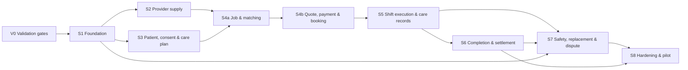

# Carespaces — MVP Delivery Backlog & Vertical Slices (P04)

> สถานะ: Draft execution baseline สำหรับวาง milestone, sprint และ issue tracker
>
> วันที่: 13 กรกฎาคม 2026
>
> อ้างอิง: `p01-design.md`, `p02-mvp-spec.md` และ `p03-domain-model.md`

## 1. วัตถุประสงค์

เอกสารนี้แปลงข้อกำหนดและ domain model เป็น backlog ที่นำไปสร้าง issue ได้ โดยรักษาหลักต่อไปนี้:

- ส่งมอบเป็น vertical slice ที่มี UI/API/data/authorization/audit/test ครบ ไม่แยกทำแต่ละ layer ยาวจนทดสอบ outcome ไม่ได้
- ทำ safety, payment correctness, privacy และ operational readiness เป็นส่วนของ story ไม่ใช่งานเก็บท้ายโครงการ
- ใช้ requirement ID จาก P02, invariant/state/event จาก P03 เป็น acceptance reference
- แยกงาน validation ที่ต้องอาศัย owner ภายนอก Engineering ออกจาก implementation แต่ถือเป็น release blocker ตาม gate
- MVP หนึ่ง Job ต่อหนึ่ง Shift, พื้นที่ pilot กรุงเทพฯ และกะภายใน 08:00–20:00 น. Asia/Bangkok

Backlog นี้ไม่กำหนดจำนวน sprint หรือวันส่งมอบแบบตายตัวจนกว่าจะทราบขนาดทีม, throughput, PSP/IdP ที่เลือก และผล region/ORM spike

## 2. Backlog conventions

### 2.1 Priority

| Priority | ความหมาย |
|---|---|
| `P0` | จำเป็นต่อ pilot, safety/compliance หรือ critical happy path; ตัดไม่ได้โดยไม่แก้ scope/decision |
| `P1` | จำเป็นต่อ operational quality ก่อนขยาย pilot แต่ pilot จำกัดวงอาจเริ่มได้เมื่อ owner ยอมรับ workaround ที่ audit ได้ |
| `P2` | หลัง pilot หรือ enhancement; ไม่รวมใน release commitment ปัจจุบัน |

### 2.2 Size

| Size | ใช้เมื่อ |
|---|---|
| `S` | เปลี่ยนขอบเขตเดียว, dependency ต่ำ, test cases จำกัด |
| `M` | ครบหนึ่ง workflow ย่อยหรือแตะหลาย components แต่ไม่มี spike ใหญ่ |
| `L` | workflow ข้าม module/external provider/concurrency หรือมี mobile/offline/financial risk |
| `XL` | ต้องแตกก่อนเข้า sprint; ใช้ระบุ epic/spike เท่านั้น |

Size เป็นความซับซ้อนสัมพัทธ์ ไม่ใช่จำนวนวัน

### 2.3 Story status

```text
BACKLOG → READY → IN_PROGRESS → IN_REVIEW → VERIFIED → DONE
                    ↘ BLOCKED
```

`DONE` ใช้ได้เมื่อผ่าน Definition of Done และ deploy ไป environment เป้าหมายของ milestone แล้ว

### 2.4 Story template

Issue tracker แต่ละ story ต้องมี:

```text
ID / Title
User or operational outcome
Scope and non-goals
Acceptance criteria
P02 requirement IDs
P03 aggregate/state/invariant/event references
API/data/UI touchpoints
Dependencies and rollout/rollback notes
Security/privacy/observability notes
Test evidence
```

## 3. Definition of Ready และ Done

### 3.1 Definition of Ready

Story เป็น `READY` เมื่อ:

- Outcome และ actor ชัดเจน
- Acceptance criteria ทดสอบได้และอ้าง requirement/state ที่เกี่ยวข้อง
- UX copy/wireframe พร้อมเมื่อ story มี user interaction
- API/data owner และ authorization rule ระบุแล้ว
- External dependency มี sandbox/contract/mocking plan
- Policy value ที่ยังไม่ล็อกถูก inject/configure ไม่ hard-code
- Risk ด้าน clinical/payment/privacy มี owner review หรือ feature-flag boundary
- Story ขนาดไม่เกิน `L`; `XL` ถูกแตกแล้ว

### 3.2 Definition of Done

ทุก P0/P1 product story ต้องผ่าน:

- Acceptance criteria และ negative cases
- Unit/domain tests สำหรับ guards/invariants
- API contract/integration tests และ migration test เมื่อแตะ data
- Authorization tests รวม cross-tenant/assignment scope
- Idempotency/concurrency test เมื่อมี retry, webhook, mobile sync หรือ scheduled deadline
- Audit event และ correlation ID สำหรับ privileged/state-changing action
- Telemetry/log ผ่าน redaction test ไม่มี PII/health/secret leakage
- Accessible loading, empty, error, retry และ offline state ตาม client ที่เกี่ยวข้อง
- Feature flag/configuration และ rollback/forward-fix plan
- Runbook/dashboard/alert เมื่อเพิ่ม operational failure mode
- Product/Design/Clinical/Finance/Ops acceptance ตาม ownership
- เอกสาร P02/P03/OpenAPI/event schema อัปเดตเมื่อ contract เปลี่ยน

## 4. Delivery strategy

### 4.1 Dependency map



Validation ไม่ต้องปิดทุกข้อก่อนเริ่ม Foundation แต่ gate ที่กำหนดต้องผ่านก่อนเปิด flow จริงหรือ production ตามตาราง V0

### 4.2 Walking skeleton

ลำดับที่ควรทำให้ระบบวิ่ง end-to-end เร็วที่สุด:

1. Customer/Admin/Provider login → tenant/role → audit event
2. Provider ส่งข้อมูล → Officer approve → Provider status แสดงใน app
3. Customer สร้าง Patient/consent/Care Plan/Job → Admin เห็น queue
4. Matching คืน candidate → reserve/confirm ด้วย fake PSP adapter → Assignment/Shift ถูกสร้าง
5. Provider check-in → checkpoint → handoff/check-out → Customer approve
6. Incident/cancellation → Ops Task → replacement outcome
7. Real PSP sandbox → ledger/refund/payout/reconciliation
8. Offline/realtime/escalation/failure drills → limited pilot

Fake adapter ใช้เพื่อ unblock contract test เท่านั้น Production gate ต้องใช้ provider ที่ผ่าน validation และ connector test จริง

### 4.3 Milestones

| Milestone | Exit outcome | Backlog groups |
|---|---|---|
| `M0 Decisions validated` | Policy/owners/adapters/region/clinical rules พร้อมให้ implementation | V0 |
| `M1 Secure foundation` | Deployable skeleton, identity, tenant, authz, audit, files, async | FND, IAM, PLT |
| `M2 Supply ready` | Provider สมัคร ส่งเอกสาร อนุมัติ และตั้ง availability ได้ | VER |
| `M3 Demand ready` | Customer สร้าง Patient, consent, Care Plan และ publish Job ได้ | PAT, CARE, JOB |
| `M4 Booking ready` | Match, reserve, quote, payment และ confirmed Assignment ได้ | MAT, PAY, ASN |
| `M5 Care loop ready` | Shift/checkpoint/handoff/completion/payout happy path จบได้ | SHIFT, REC, CMP |
| `M6 Safety operations ready` | Incident, SOS, cancellation, replacement, dispute และ ops queues ใช้งานได้ | INC, REP, DSP, OPS |
| `M7 Pilot ready` | Security, resilience, reconciliation, DR, load และ operational drills ผ่าน | HRD, PILOT |

## 5. V0 — Validation and policy gates

| ID | Pri | Size | Outcome / deliverable | Acceptance | Dependency / gate owner |
|---|---|---|---|---|---|
| `VAL-01` | P0 | L | Managed marketplace legal model | Legal memo/decision ระบุ contract parties, liability, tax, worker classification และข้อความที่ห้ามใช้; risks มี owner/mitigation | Founder + Legal; blocks production Gate B |
| `VAL-02` | P0 | L | PSP capability decision | ทดสอบ sandbox flow authorization/capture/void/refund/payout, recipient KYC, webhook ordering/signature, settlement export; บันทึก adapter mapping/fallback | Legal + Finance + Eng; blocks PAY production |
| `VAL-03` | P0 | M | Clinical activity policy v1 | ตาราง provider type/verified skill/certificate/allowed/restricted activity/risk review ลงนามโดย Clinical owner | Clinical; blocks Job publish/approval |
| `VAL-04` | P0 | M | Pilot service area | รายชื่อเขต, coarse-location rules, provider-density threshold และ serviceability config ได้รับอนุมัติ | Product + Ops; blocks pilot bookings |
| `VAL-05` | P0 | M | Care Ops SLA/roster | Roster 08:00–20:00 ทุกวัน, queue owner/backup, acknowledgement/replacement timers และ customer copy พร้อม | Ops; blocks Gate C |
| `VAL-06` | P0 | M | AWS region decision | Thailand capability/quota/cost/support test; หากไม่ผ่านมี Singapore + DPO transfer decision; ADR-002 approved | Eng + DPO; blocks production infrastructure |
| `VAL-07` | P0 | M | Identity/KYC provider selection | IdP/customer verification/provider identity sources, MFA/step-up และ recovery flow ผ่าน Legal/Security review | Product + Legal + Eng; blocks IAM integration |
| `VAL-08` | P0 | M | Data governance pack | Data inventory, consent/notice, retention matrix, DSR, processor/cross-border controls approved | DPO + Legal; blocks production data |
| `VAL-09` | P0 | M | Pricing/financial policy v1 | Rate card, fees, cancellation/no-show/overtime/expense, dispute window, refund/payout schedule, maker-checker threshold versioned | Product + Finance; blocks quote/payment launch |
| `VAL-10` | P0 | S | ORM/database spike | Prisma/Drizzle test ครอบคลุม PostGIS, RLS, exclusion constraint, raw SQL, transaction และ migration rollback; ADR result approved | Engineering; blocks production schema |

## 6. S1 — Secure foundation

### Epic FND — Repository, delivery และ runtime

| ID | Pri | Size | Story / outcome | Acceptance | Trace | Depends |
|---|---|---|---|---|---|---|
| `FND-01` | P0 | M | Scaffold pnpm/Turborepo monorepo | Apps/packages ตาม P01 build/test/lint/typecheck ได้; shared config ไม่ expose persistence model ให้ client | P01 §14 | VAL-10 |
| `FND-02` | P0 | L | Infrastructure/environment baseline | Dev/staging/prod account boundary, Terraform plan, private data subnets, ECS service skeleton, RDS/Redis/S3/SQS/DLQ/KMS/Secrets พร้อม least privilege | P01 §12 | VAL-06 |
| `FND-03` | P0 | M | CI/CD with OIDC | PR checks, migration validation, artifact provenance, environment promotion และ approval; ไม่มี long-lived cloud key | P01 §15 | FND-01, FND-02 |
| `FND-04` | P0 | M | Database migration framework | Forward migration + rollback/restore rehearsal, schema ownership convention, seed synthetic data, no production-data copy | P03 §12 | FND-01, VAL-10 |
| `FND-05` | P0 | M | API/OpenAPI skeleton | NestJS `/v1`, validation/error envelope, request/correlation ID, generated typed client และ contract test | P01 §4, P03 §2 | FND-01 |
| `FND-06` | P0 | L | Observability and redaction baseline | OpenTelemetry logs/metrics/traces; PII/health/token redaction tests; alert routing and correlation across API/worker | OPS-06, P01 §13 | FND-02, FND-05 |
| `FND-07` | P0 | M | Feature/configuration management | Environment-safe versioned config for service area, hours, deadlines, policy refs; change approval/audit; no client hard-code | P03 §15 | FND-04 |
| `FND-08` | P0 | M | Test harness and synthetic fixtures | Unit/domain/contract/e2e test projects, fake IdP/PSP/notification/maps adapters, deterministic clock/UUID helpers | E2E-01–10 | FND-01, FND-05 |

### Epic PLT — Reliable async, files และ audit

| ID | Pri | Size | Story / outcome | Acceptance | Trace | Depends |
|---|---|---|---|---|---|---|
| `PLT-01` | P0 | L | Inbox/outbox event backbone | Business state + outbox atomic; event envelope v1; publish/consume at-least-once; dedupe, retry, DLQ และ replay audit | INV-11, INV-14, P03 §8 | FND-04, FND-06 |
| `PLT-02` | P0 | M | Scheduled deadline service | Create/cancel/fire deadlines idempotently; handler rechecks state/version; operational dashboard for overdue/failures | P03 §10 | PLT-01 |
| `PLT-03` | P0 | L | Secure document pipeline | Presigned upload, quarantine, type/size validation, malware scan, clean promotion, short-lived download authorization | CARE/VER attachments, P01 §9 | FND-02, FND-05 |
| `PLT-04` | P0 | M | Audit and state-transition writer | Append-only audit/transition, actor/reason/correlation/version; privileged read/export/override trace; query projection | IAM-07, OPS-05–07, INV-14 | FND-04, FND-06 |
| `PLT-05` | P0 | M | Idempotent command middleware | `Idempotency-Key`/command ID storage, same-result replay, expected-version conflict response; TTL/retention policy | PAY-07, INV-11, P03 §6.1 | FND-05, FND-04 |
| `PLT-06` | P0 | M | Ops Task core | Create/claim/reassign/resolve task, queue/priority/owner/due/escalation fields, optimistic concurrency และ domain-event API; feature modules สร้าง task ได้โดยไม่ผูก Admin UI | OPS-04, P03 §4.8 | PLT-01–02, IAM-04 |

### Epic IAM — Identity, tenant และ authorization

| ID | Pri | Size | Story / outcome | Acceptance | Trace | Depends |
|---|---|---|---|---|---|---|
| `IAM-01` | P0 | L | Customer/Provider authentication | Register/login/contact verification/recovery/logout; identity adapter; auth account ไม่ทำให้ Provider approved | IAM-01–02 | VAL-07, FND-05 |
| `IAM-02` | P0 | M | Family tenant and membership | Customer onboarding สร้าง FAMILY tenant/membership idempotently; cross-tenant access denied | IAM-04, INV-10 | IAM-01, FND-04 |
| `IAM-03` | P0 | M | Platform roles and MFA | Admin roles require MFA/privileged session; revoked role stops new request; role action audited | IAM-03, IAM-07 | IAM-01, PLT-04 |
| `IAM-04` | P0 | L | RBAC + ABAC policy layer | Capability + tenant/patient/assignment/queue/sensitivity checks; deny by default; field-level projections | IAM-04, P03 §7 | IAM-02, IAM-03 |
| `IAM-05` | P0 | M | Patient access grant service | Grant/revoke/expire relationship-scoped capability; consent link; revocation effective immediately | IAM-05–06, INV-10 | IAM-04 |
| `IAM-06` | P0 | M | Sensitive access logging | Clinical/exact-address/document read creates purpose/resource/actor log; Finance/Support projections masked | OPS-07, P03 §11 | IAM-04, PLT-04 |
| `IAM-07` | P0 | M | Break-glass workflow | Step-up MFA, structured reason/ticket/expiry, alert/review log; cannot bypass qualification/ledger/PSP restriction | IAM-07, P03 §7.4 | IAM-03, IAM-04, PLT-01, PLT-04 |
| `IAM-08` | P0 | M | Authorization regression suite | Cross-tenant, missing grant, pre-confirm address, Finance clinical deny, maker-checker and expired grant tests pass | P03 §13.3 | IAM-04–07, FND-08 |

## 7. S2 — Provider supply

### Epic VER — Provider onboarding, verification และ availability

| ID | Pri | Size | Story / outcome | Acceptance | Trace | Depends |
|---|---|---|---|---|---|---|
| `VER-01` | P0 | M | Provider profile onboarding | Applicant กรอก provider type, experience, service area, skills และ payout-onboarding placeholder; draft/resume ได้ | VER-01 | IAM-01, IAM-04 |
| `VER-02` | P0 | L | Credential/document submission | Upload ผ่าน quarantine, required-doc checklist ตาม provider type, revision/resubmit และ masked identifiers | VER-01–02 | VER-01, PLT-03 |
| `VER-03` | P0 | L | Verification officer queue | Claim case atomically, view authorized evidence/checklist, request info/reject/approve with reason/policy/audit | VER-02–04, P03 §6.2 | IAM-03–06, PLT-04, VER-02, VAL-03 |
| `VER-04` | P0 | M | Approval enforcement | เฉพาะ `APPROVED` ค้นหา/รับ broadcast/reserve/payout ได้; ไม่มี conditional assignment | VER-03, INV-03 | VER-03, IAM-04 |
| `VER-05` | P0 | M | Credential expiry lifecycle | Reminder/deadline, `EXPIRED`, block new work, scan future assignments และสร้าง Ops Task | VER-05–07 | PLT-02, PLT-06, VER-03 |
| `VER-06` | P0 | M | Suspension/reinstatement | Authorized reasoned action, immediate block, affected-assignment scan, re-review before reinstate | VER-07, P03 §6.2 | VER-03, PLT-01, PLT-06 |
| `VER-07` | P0 | M | Availability and service area | Provider CRUD availability, timezone validation, overlap visibility และ coarse service area; assignment remains source of booking truth | MAT-02, P03 §4.4 | VER-04, VAL-04 |
| `VER-08` | P0 | M | Provider onboarding E2E | Draft→submit→need info→approve; expired/suspended Provider cannot receive or confirm work; audits/events verified | E2E-02, E2E-10 | VER-01–07, FND-08 |

## 8. S3 — Patient, consent, Care Plan และ Job

### Epic PAT — Patient and consent

| ID | Pri | Size | Story / outcome | Acceptance | Trace | Depends |
|---|---|---|---|---|---|---|
| `PAT-01` | P0 | M | Patient profile CRUD | Customer ที่มี grant สร้าง/แก้ profile ขั้นต่ำได้; Patient แยกจาก User; sensitive fields protected | PAT-01–02 | IAM-02, IAM-04, VAL-08 |
| `PAT-02` | P0 | M | Contacts and emergency contact | Primary/emergency/representative contacts, priority/channel validation; publish guard ต้องมี emergency contact | PAT-01, INC-02 | PAT-01 |
| `PAT-03` | P0 | L | Consent/authority capture | Relationship, authority evidence, purpose/scope, notice version, effective/expiry; grant link; withdraw/supersede audit | IAM-05–06, P03 §4.3 | PAT-01, IAM-05, PLT-03, VAL-08 |
| `PAT-04` | P0 | M | Patient access UI and negative tests | Customer เห็นเฉพาะ Patient ที่มี grant; revoke/expire หยุด access; cross-tenant tests pass | IAM-04–06 | PAT-03, IAM-08 |

### Epic CARE — Versioned Care Plan

| ID | Pri | Size | Story / outcome | Acceptance | Trace | Depends |
|---|---|---|---|---|---|---|
| `CARE-01` | P0 | M | Care Plan templates and draft editor | Customer เลือก template/สร้าง draft; tasks มี activity/instruction/mandatory/conditional/evidence | CARE-01–02 | PAT-01, VAL-03 |
| `CARE-02` | P0 | L | Qualification/activity validation | Task mapping ใช้ clinical policy version; restricted/risk plan route review; medication wording ไม่เป็นคำสั่งรักษา | CARE-05–06, INV-04 | CARE-01, VAL-03 |
| `CARE-03` | P0 | M | Clinical review queue | Reviewer approve/reject/request changes with reason; separation from ledger role; audited sensitive access | CARE-06 | CARE-02, IAM-04–06, PLT-06 |
| `CARE-04` | P0 | M | Publish and version immutability | Published version immutable; edit creates next draft/change reason/effective time; supersede does not repin active Shift | CARE-03–04, INV-06 | CARE-02, CARE-03, PLT-04 |
| `CARE-05` | P0 | M | Customer Care Plan version UI | แสดง draft/published/history/change reason/reviewer; warning เมื่อ future booking ใช้ version เก่า | CARE-03–04 | CARE-04 |

### Epic JOB — Job creation and serviceability

| ID | Pri | Size | Story / outcome | Acceptance | Trace | Depends |
|---|---|---|---|---|---|---|
| `JOB-01` | P0 | L | Job creation wizard | เลือก Patient/Care Plan, location/time/duration/urgency/requirements; save draft; sensitive copy reviewed | JOB-01–02 | PAT-03, CARE-04 |
| `JOB-02` | P0 | M | Operating/serviceability guard | Reject outside pilot/08:00–20:00 or invalid interval; emergency-at-booking redirects to direct emergency guidance | JOB-03–05, INV-05 | JOB-01, VAL-04–05, FND-07 |
| `JOB-03` | P0 | M | Clinical/job review route | Complex/risk/restricted job pending review; approved returns open; changes preserve reason/version | JOB-05, CARE-06 | JOB-01, CARE-03 |
| `JOB-04` | P0 | M | Publish and requirement snapshot | Active consent/emergency contact/published Care Plan required; immutable requirement/policy snapshot and expiry | JOB-01–05, INV-04 | JOB-01–03, PAT-03 |
| `JOB-05` | P0 | M | Job edit/invalidation | Material edit increments requirement version, invalidates stale match/quote/reservation, requires reconfirmation | JOB-07, P03 §4.6 | JOB-04, PLT-01 |
| `JOB-06` | P0 | M | Customer/Admin job projections | Customer status/history; Admin queue; candidate view excludes exact address/full health data | JOB-06, INV-10 | JOB-04, IAM-04–06 |

## 9. S4 — Matching, quote, payment และ booking

### Epic MAT — Qualification and explainable matching

| ID | Pri | Size | Story / outcome | Acceptance | Trace | Depends |
|---|---|---|---|---|---|---|
| `MAT-01` | P0 | L | Hard qualification gate | Status/credential/type/skill/activity/availability/service area/block/clinical approval checked before rank; reason codes stored | MAT-01–02, INV-03, INV-12 | VER-07, JOB-04, VAL-03 |
| `MAT-02` | P0 | L | Deterministic ranking v1 | Policy-versioned features/rank/reason snapshot; same input/policy deterministic; incident raw rate not punitive | MAT-03–04, P03 §4.6 | MAT-01 |
| `MAT-03` | P0 | M | Customer candidate comparison | Verified qualifications, experience/aggregate, availability, price placeholder and match reasons; no internal score | MAT-04, P03 §11.1 | MAT-02, IAM-04 |
| `MAT-04` | P0 | L | Candidate invitation/application | Provider sees minimum-safe Job card, invite/apply/decline/withdraw; applicant/unqualified cannot access | MAT-04–05, JOB-06 | MAT-01, VER-04, IAM-04 |
| `MAT-05` | P0 | L | Atomic reservation and expiry | Selected candidate creates one reservation with server countdown; stale/parallel selection conflict; expiry returns Job to matching | MAT-06–07, INV-01–02 | MAT-03–04, PLT-02, PLT-05 |
| `MAT-06` | P0 | L | Urgent qualified broadcast waves | Qualified minimal-data waves, atomic winner, deadline/escalation Ops Task; no pure first-come bypass | MAT-07–08, E2E-03 | MAT-01, MAT-05, PLT-06 |
| `MAT-07` | P0 | M | Matching audit and replay test | MatchRun/input/reason/policy explainable; rerun creates new record; concurrent and stale-version tests pass | MAT-01–08 | MAT-01–06, FND-08 |

### Epic PAY — Quote, PSP, ledger และ reconciliation

| ID | Pri | Size | Story / outcome | Acceptance | Trace | Depends |
|---|---|---|---|---|---|---|
| `PAY-01` | P0 | L | Versioned rate-card engine | Quote line items/tax/fees/discount/total/provider payout deterministic from policy snapshot; integer minor units | PAY-01–03, P03 §4.9 | VAL-09, FND-07 |
| `PAY-02` | P0 | M | Quote presentation and acceptance | Customer sees scope/provider/policy/SLA/totals/expiry; Provider sees expected payout; accepted quote immutable | PAY-01–03, UX §10 | PAY-01, MAT-05 |
| `PAY-03` | P0 | L | PSP adapter and sandbox contract | Create/authorize/capture/void/refund/payout operations map to domain; fake/real adapters pass shared contract tests | PAY-04–07 | VAL-02, FND-08 |
| `PAY-04` | P0 | L | Signed webhook inbox | Verify signature/raw-body handling, encrypt/minimize retention, dedupe provider event, tolerate duplicate/out-of-order/late events | PAY-06–07, INV-11 | PAY-03, PLT-01 |
| `PAY-05` | P0 | L | Double-entry ledger core | Accounts/transactions/entries balance per currency, immutable/reversal correction, posting idempotent | PAY-08, INV-07–09 | FND-04, PLT-05 |
| `PAY-06` | P0 | L | Payment authorization/collection flow | Assignment advances only on verified PSP condition; failure/expiry compensation void/refund/release reservation correctly | PAY-04–07, E2E-01 | PAY-02–05, MAT-05 |
| `PAY-07` | P0 | L | Refund workflow | Policy calculation, request/approval/maker-checker, partial/max guard, PSP confirmation and ledger adjustment | PAY-11, DSP-04–05, INV-08 | PAY-03–05, VAL-09, IAM-04 |
| `PAY-08` | P0 | L | Payout workflow | Eligibility after completion/policy, KYC check, hold/retry/late confirmation, PSP success + ledger state separate | PAY-09–10, INV-09 | PAY-03, PAY-05, VAL-09 |
| `PAY-09` | P0 | L | Daily reconciliation | Import PSP settlement, match payment/refund/payout/ledger, exception Ops Task, replay-safe rerun/report | PAY-12 | PAY-04–08, PLT-06 |
| `PAY-10` | P0 | M | Finance/Admin projections | Finance sees masked booking completion/payment timeline, refund/payout/recon queues; no full clinical note | IAM-04, PAY-12, INV-10 | PAY-05–09, IAM-06 |

### Epic ASN — Booking confirmation

| ID | Pri | Size | Story / outcome | Acceptance | Trace | Depends |
|---|---|---|---|---|---|---|
| `ASN-01` | P0 | L | Provider confirmation flow | Provider accepts current scope/payout before expiry; qualification/credential/schedule rechecked; decline returns matching | MAT-05–07, INV-03 | MAT-05, PAY-02 |
| `ASN-02` | P0 | L | Atomic Assignment confirmation | Payment condition + expected state + conflict lock confirm one Assignment and create one Shift; stale commands rejected | E2E-01–03, INV-01–04 | ASN-01, PAY-06, PLT-05 |
| `ASN-03` | P0 | M | Post-confirm access and notifications | Grant provider shift-packet access, reveal exact address, create reminders; cancellation/replacement revokes access per policy | JOB-06, SHIFT-01, INV-10 | ASN-02, IAM-05, OPS-01 |
| `ASN-04` | P0 | L | Booking compensation tests | Provider/payment/qualification/conflict failure at every saga step releases/voids/refunds once and leaves explainable state | P03 §9.1, INV-11 | ASN-01–03, FND-08 |

## 10. S5 — Shift execution and care records

### Epic SHIFT — Provider mobile shift

| ID | Pri | Size | Story / outcome | Acceptance | Trace | Depends |
|---|---|---|---|---|---|---|
| `SHIFT-01` | P0 | L | Offline-readable shift packet | Assigned Provider only; pinned Care Plan/checklist/contact/restriction cached encrypted; refresh/version/status visible | SHIFT-01, CARE-04 | ASN-03, IAM-04 |
| `SHIFT-02` | P0 | M | Preparing/travel/arrival status | Allowed transitions only, server timestamp, approved event location, Customer realtime projection | SHIFT-02, SHIFT-10 | SHIFT-01, RT-01 |
| `SHIFT-03` | P0 | L | Online check-in | Confirmed assignment/actor/pre-shift credential guard; server/device/location/accuracy/permission/client ID; geofence signal only | SHIFT-03–04, E2E-10 | SHIFT-01, VER-05, PLT-05 |
| `SHIFT-04` | P0 | L | Dynamic care checklist | Mandatory/conditional tasks from pinned version, structured values/units/evidence, medication confirmation categories | SHIFT-05–06 | SHIFT-03, CARE-04, PLT-03 |
| `SHIFT-05` | P0 | L | Offline checkpoint queue and sync | Local encrypted queue, client IDs, retry/dedupe, sync cursor, visible pending/error/conflict; forbidden commands require online | SHIFT-07–08, E2E-04 | SHIFT-04, PLT-05 |
| `SHIFT-06` | P0 | M | Care-record correction | Submitted record immutable; authorized correction references original/reason; Customer/Admin projection shows corrected truth/history appropriately | SHIFT-08, INV-06 | SHIFT-04–05, PLT-04 |
| `SHIFT-07` | P0 | L | Handoff and online checkout | Missing summary, mandatory missing reason, incident refs, final attestation; online finalize; idempotent event | SHIFT-09, P03 §6.6 | SHIFT-04–06 |
| `SHIFT-08` | P0 | M | Early termination | Active shift uses structured early-termination, partial handoff and event hooks for incident/replacement; no silent cancellation/data loss | P03 §6.6 | SHIFT-03–07, PLT-01 |
| `SHIFT-09` | P0 | M | Customer live care view | State/checkpoint/handoff according to grant; no continuous GPS; disconnect/reconnect and stale-state behavior clear | SHIFT-10, INV-10 | SHIFT-02–07, RT-01 |

### Epic RT — Realtime and notifications foundation

| ID | Pri | Size | Story / outcome | Acceptance | Trace | Depends |
|---|---|---|---|---|---|---|
| `RT-01` | P0 | L | Authenticated realtime gateway | Tenant/resource authorization, Redis fan-out, reconnect/resync, sequence/version; DB remains truth; p95 target observed | SHIFT-10, P01 §5 | IAM-04, PLT-01, FND-06 |
| `RT-02` | P0 | L | Notification delivery adapters | Push/SMS/email adapters, token/device lifecycle, delivery attempts/retry, privacy-safe body | OPS-01–02 | IAM-01, PLT-01, FND-06 |
| `RT-03` | P0 | L | Critical acknowledgement/escalation | Separate acknowledgement token/state/deadline, fallback channel/Ops Task; delivery receipt never equals ack | OPS-03, INV-13 | RT-02, PLT-02, PLT-06 |

## 11. S6 — Completion and settlement

### Epic CMP — Completion and review

| ID | Pri | Size | Story / outcome | Acceptance | Trace | Depends |
|---|---|---|---|---|---|---|
| `CMP-01` | P0 | M | Customer work approval | Eligible Customer reviews final handoff and approves once; Assignment/Job complete; audit/notification | DSP-01, E2E-01 | SHIFT-07, IAM-04 |
| `CMP-02` | P0 | L | Approval/dispute deadline and auto-complete | Reminder/deadline; auto-complete only when no open dispute/blocking incident; race with dispute atomic | PAY-09, DSP-01, E2E-08–09 | CMP-01, PLT-02, PLT-05 |
| `CMP-03` | P0 | L | Completion-to-payout saga | Post payable ledger, eligibility/hold/submission/PSP confirmation; retry/reconcile without duplicate | PAY-09–12, P03 §9.3 | CMP-01–02, PAY-08–09 |
| `CMP-04` | P0 | M | Customer review | One review per completed booking, rating/comment, moderation/report flow, aggregate privacy threshold | REV-01–03, INV-15 | CMP-01, PLT-06 |
| `CMP-05` | P1 | M | Provider earnings view | Expected, pending, on-hold, eligible, submitted, paid/failed status with masked payment refs; no ledger ambiguity | PAY-10, VER scope | CMP-03, PAY-10 |

## 12. S7 — Incident, replacement, dispute and operations

### Epic INC — Incident and SOS

| ID | Pri | Size | Story / outcome | Acceptance | Trace | Depends |
|---|---|---|---|---|---|---|
| `INC-01` | P0 | L | Incident reporting | Provider/Customer active scope and Admin case scope; category/severity/time/note/evidence/location; append-only timeline | INC-01, INC-03, INC-06 | SHIFT-03, PLT-03–04 |
| `INC-02` | P0 | L | SOS mobile flow | Direct-call 1669/emergency contact prominent and backend-independent; incident attempt/location; offline failure/draft copy clear | INC-02–04, E2E-05 | PAT-02, INC-01 |
| `INC-03` | P0 | L | Incident acknowledgement/escalation | Human ack, severity timer, fallback/Ops Task/escalation; late/duplicate event idempotent | INC-05, INV-13 | INC-01, RT-03 |
| `INC-04` | P0 | L | Triage/resolution console | Queue claim, category/severity/owner/actions/outcome/follow-up; Clinical approval by policy; reopen history | INC-06–07 | INC-03, IAM-04–06, PLT-06 |
| `INC-05` | P0 | M | Safety copy and degradation tests | ทุก surface ระบุไม่ใช่ EMS; API/realtime/push outage simulation ยัง direct-call ได้; sensitive notification redacted | INC-02, INC-08 | INC-02–04, FND-08 |

### Epic REP — Cancellation and replacement

| ID | Pri | Size | Story / outcome | Acceptance | Trace | Depends |
|---|---|---|---|---|---|---|
| `REP-01` | P0 | L | Cancellation policy workflow | Customer/Provider/Admin reason/evidence; fee/refund calculation; confirmed Provider cancellation opens replacement/ops task | REP-01–02, PAY-11 | ASN-02, PAY-07, VAL-09 |
| `REP-02` | P0 | L | Replacement request saga | Open/search/reserve/confirm/handover/close with deadlines/failure paths and complete audit | REP-02–04, P03 §9.2 | REP-01, MAT-01, PLT-02 |
| `REP-03` | P0 | L | Atomic replacement confirmation | Replacement hard gate, payment delta, original terminal/replaced + new confirmed in one transaction; no active overlap | REP-03, INV-01–03, INV-12 | REP-02, PAY-06, ASN-02 |
| `REP-04` | P0 | M | Replacement handover/access | Minimum data before confirm; exact packet/grant after confirm; Care Plan/current incident handover; revoke old access | REP-03–05, INV-10 | REP-03, IAM-05, SHIFT-01 |
| `REP-05` | P0 | M | SLA/customer communication | Best-effort wording, area/case deadline, out-of-hours no live SLA, transition notifications | REP-06–07 | VAL-05, REP-02, RT-02 |
| `REP-06` | P0 | M | Replacement failure outcome | Notify, close failed, cancellation/refund result, Ops Task/metric; no false guarantee | REP-08, E2E-07 | REP-02, PAY-07 |
| `REP-07` | P0 | L | Replacement concurrency suite | Race original return/replacement confirm, candidate parallel accept, deadline late event and payment failure produce one consistent outcome | E2E-06–07, P03 §13.2 | REP-01–06, FND-08 |

### Epic DSP — Dispute

| ID | Pri | Size | Story / outcome | Acceptance | Trace | Depends |
|---|---|---|---|---|---|---|
| `DSP-01` | P0 | M | Open dispute and evidence | Eligible Customer within window/authorized exception; category/evidence; payout hold; privacy-scoped party notifications | DSP-01–03 | CMP-01–02, PLT-03 |
| `DSP-02` | P0 | L | Evidence/review workspace | Assigned officer sees immutable timeline/authorized evidence; deadline; Provider response; Clinical/Finance projections separated | DSP-02–04, INV-10 | DSP-01, IAM-04–06, PLT-02 |
| `DSP-03` | P0 | L | Decide and adjust | Structured outcome/reason, maker-checker threshold, idempotent refund/payout/ledger commands; no original-entry edit | DSP-04–05, INV-07–09 | DSP-02, PAY-07–08 |
| `DSP-04` | P0 | M | Resolve/close/reopen | Financial/ops effects confirmed or waived, parties notified, hold released/settled, authorized reopen audited | DSP-05, P03 §6.10 | DSP-03, RT-02 |
| `DSP-05` | P0 | L | Approval-vs-dispute concurrency tests | Auto-complete and dispute race has one winner; no payout release while valid dispute open; retry safe | E2E-09, INV-11 | DSP-01–04, CMP-02, FND-08 |

### Epic OPS — Admin operations

| ID | Pri | Size | Story / outcome | Acceptance | Trace | Depends |
|---|---|---|---|---|---|---|
| `OPS-01` | P0 | L | Unified Ops Task queues | Verification/clinical/urgent/active incident/replacement/dispute/finance queues; priority/owner/SLA/status; atomic claim | OPS-04, P03 §4.8 | IAM-03–04, PLT-06 |
| `OPS-02` | P0 | M | Notification intent center | Intent/template/channel/delivery attempts; user preferences where allowed; critical events cannot be disabled | OPS-01–03 | RT-02–03 |
| `OPS-03` | P0 | M | Manual override framework | Capability allowlist, expected state, reason, step-up/checker where required, audit and notification | OPS-05–06, INV-14 | IAM-03–07, PLT-04–05 |
| `OPS-04` | P0 | M | Operations dashboards/alerts | Queue age, SLA breach, DLQ, webhook/recon, incident ack, replacement and payout failures with runbook links | OPS-04, PAY-12 | FND-06, OPS-01, PAY-09 |
| `OPS-05` | P1 | M | Pilot metrics dashboard | Qualified fill/time-to-confirm/cancel/on-time/checkpoint/report/replacement/dispute/recon metrics, sanitized dimensions only | P02 §2.2 | Core event flows, FND-06 |

## 13. S8 — Hardening and pilot readiness

### Epic HRD — Security, resilience, performance และ recovery

| ID | Pri | Size | Story / outcome | Acceptance | Trace | Depends |
|---|---|---|---|---|---|---|
| `HRD-01` | P0 | L | Threat model and privacy review | Data flow/threat/abuse cases for identity, health docs, payment, mobile, admin; critical/high findings closed | P01 §9, Gate D | Feature-complete architecture |
| `HRD-02` | P0 | L | Authorization penetration suite | IDOR/cross-tenant/role escalation/presigned URL/admin session/break-glass tests; critical/high closed | IAM-04–07, INV-10 | IAM-08, PLT-03 |
| `HRD-03` | P0 | L | Payment/webhook chaos tests | Duplicate/out-of-order/late/forged webhook, timeout after side effect, reconciliation mismatch and retry pass | PAY-04–12, INV-07–11 | PAY-03–09 |
| `HRD-04` | P0 | L | Scheduling/replacement load and race tests | Target pool/concurrency meets p95; no double assignment/reservation; urgent/replacement races preserve invariants | INV-01–03, P01 §13 | MAT-05–06, REP-07 |
| `HRD-05` | P0 | L | Mobile offline/device test matrix | Common Android devices, permission denied/low accuracy, process kill, duplicate sync, low storage/network transitions pass | SHIFT-03–08 | SHIFT-01–08 |
| `HRD-06` | P0 | M | Notification/realtime failure drills | Push unavailable, ack timeout, Redis loss/reconnect, stale client, fallback channel and Ops Task behave as runbook | OPS-01–04, INV-13 | RT-01–03, INC-03 |
| `HRD-07` | P0 | L | Backup/restore and DR drill | RPO≤15m/RTO≤2h target tested; RDS/object/config restore, secrets/queues procedure and evidence captured | P01 §13 | FND-02–04, PLT-01 |
| `HRD-08` | P0 | M | DLQ/replay and worker crash drill | Crash after side effect/before ack, redrive and replay produce no duplicate business effect; alerts/runbook verified | INV-11, P01 failure tests | PLT-01–02, FND-06 |
| `HRD-09` | P0 | M | Accessibility/content review | Customer/Admin web and Provider mobile critical flows pass keyboard/screen reader/contrast/touch/error copy; Thai terminology approved | P02 §10 | All client stories |
| `HRD-10` | P0 | L | Security testing and release remediation | SAST/dependency/container/IaC/DAST/penetration results triaged; critical/high closed; accepted residual risks signed | Gate D | HRD-01–09 |

### Epic PILOT — Operational launch

| ID | Pri | Size | Story / outcome | Acceptance | Trace | Depends |
|---|---|---|---|---|---|---|
| `PILOT-01` | P0 | M | Synthetic full-care simulation | E2E-01–10 run with all roles, evidence/audit/metrics reviewed; defects have severity/owner | P02 E2E-01–10 | M6 complete |
| `PILOT-02` | P0 | M | Clinical incident tabletop | SOS, medication deviation, provider early termination, credential expiry and handoff scenarios; runbook/owner/timers verified | Gate A/C | INC, REP, VER complete |
| `PILOT-03` | P0 | M | Finance settlement rehearsal | Charge/authorization, cancel, partial/full refund, dispute, payout failure/late success and daily recon close correctly | Gate B/C | PAY, DSP complete |
| `PILOT-04` | P0 | S | Production readiness review | Gate A–D checklist signed; region/PSP/IdP/policy versions recorded; rollback/on-call/contact tree ready | P02 §13 | VAL, HRD, PILOT-01–03 |
| `PILOT-05` | P0 | M | Limited-area feature-controlled launch | Allowlist/area/hours/capacity controls, live metrics/alerts, daily review and stop criteria active | D-02, D-06 | PILOT-04 |
| `PILOT-06` | P1 | M | Pilot learning review | Metrics/qualitative feedback, policy exceptions, incidents/recon findings; prioritized decision for expansion/iteration | P02 §2.2 | Pilot observation window |

## 14. Requirement coverage matrix

| P02 requirements | Primary backlog coverage |
|---|---|
| IAM-01–07 | IAM-01–08, PAT-03–04, PLT-04, HRD-02 |
| PAT-01–02 | PAT-01–04 |
| CARE-01–06 | CARE-01–05, SHIFT-01/04 |
| VER-01–07 | VER-01–08, ASN-01, E2E/HRD credential tests |
| JOB-01–07 | JOB-01–06, MAT-04, PAY-02 |
| MAT-01–08 | MAT-01–07, ASN-01–04, HRD-04 |
| PAY-01–12 | PAY-01–10, CMP-02–03, REP-01/06, DSP-03, HRD-03 |
| SHIFT-01–10 | SHIFT-01–09, RT-01, HRD-05–06 |
| INC-01–08 | INC-01–05, RT-03, PILOT-02 |
| REP-01–08 | REP-01–07, OPS-01/04, PILOT-02 |
| DSP-01–05 | DSP-01–05, CMP-02–03, PILOT-03 |
| REV-01–03 | CMP-04, PLT-06, OPS-01 |
| OPS-01–07 | PLT-04, IAM-06–07, RT-02–03, OPS-01–05, HRD-06 |
| P02 E2E-01–10 | FND-08, feature-level E2E stories, PILOT-01 |

## 15. P03 invariant coverage

| Invariant | Implementation / verification stories |
|---|---|
| INV-01 Active Assignment ต่อ Job | MAT-05, ASN-02, REP-03, HRD-04 |
| INV-02 Provider schedule overlap | VER-07, MAT-05, ASN-02, HRD-04 |
| INV-03 Qualification/payment before confirm | MAT-01, ASN-01–02, PAY-06 |
| INV-04 Published pinned Care Plan | CARE-04, JOB-04, ASN-02, SHIFT-01 |
| INV-05 Service hours/area | JOB-02, VAL-04–05, PILOT-05 |
| INV-06 Immutable published/submitted records | CARE-04, SHIFT-06, PAY-05, PLT-04 |
| INV-07 Balanced ledger | PAY-05, HRD-03, PILOT-03 |
| INV-08 Refund cap | PAY-07, HRD-03 |
| INV-09 Payout guards | PAY-08, CMP-03, DSP-03 |
| INV-10 Need-to-know | IAM-04–06/08, ASN-03, HRD-02 |
| INV-11 Idempotency | PLT-01/05, PAY-04, SHIFT-05, HRD-03/08 |
| INV-12 Replacement qualification | MAT-01, REP-02–03 |
| INV-13 Delivery ≠ acknowledgement | RT-03, INC-03, HRD-06 |
| INV-14 Transition audit | PLT-04–05, OPS-03 |
| INV-15 One eligible Review | CMP-04, IAM-04 |

## 16. Suggested issue creation order

ลำดับสร้าง issue/ทำ refinement:

1. สร้าง V0 ทุกข้อและกำหนด owner/due date ก่อน
2. สร้าง FND/PLT/IAM เป็น milestone M1; แยก `L` ตาม API/data/client/test หากยังเกินหนึ่ง sprint
3. Refine VER และ PAT/CARE พร้อมกันเมื่อ IAM policy contract ชัด
4. Refine JOB/MAT โดยใช้ clinical policy fixture จริงจาก VAL-03
5. Refine PAY/ASN หลัง PSP contract จาก VAL-02 และ pricing policy จาก VAL-09
6. Refine SHIFT/RT โดยทำ device/offline spike บน Android จริงตั้งแต่ต้น
7. Refine INC/REP/DSP/OPS พร้อม runbook และคนรับ queue ไม่ใช่เฉพาะหน้าจอ
8. เปิด HRD/PILOT issues ตั้งแต่ต้นและสะสมหลักฐานต่อเนื่อง ไม่รอ feature complete

## 17. Critical path และงานที่ทำขนานได้

### Critical path

```text
VAL-03/07/10
→ FND + IAM
→ Provider + Patient/Care Plan
→ Job/Matching
→ PSP/Quote/Assignment
→ Shift/Handoff/Completion
→ Incident/Replacement/Dispute
→ Hardening/Gates
→ Pilot
```

### Parallel lanes

- Platform lane: FND, PLT, IAM, observability, security
- Supply lane: VER + Provider mobile onboarding/availability
- Demand lane: PAT, CARE, JOB + Customer/Admin web
- Finance lane: VAL-02/09, PAY, reconciliation
- Care execution lane: SHIFT, RT, mobile offline
- Safety/Ops lane: INC, REP, DSP, OPS และ runbooks
- Quality lane: automated tests, threat model, accessibility, DR/load/chaos evidence

ทีมเล็กควรรักษา vertical-slice order และจำกัด work in progress แทนการเปิดทุก lane พร้อมกัน

## 18. Scope-control rules

คำขอต่อไปนี้ต้องเข้าสู่ change control และไม่เพิ่มเข้า MVP backlog โดยอัตโนมัติ:

- B2B organization/billing/SSO
- Recurring, overnight, live-in หรือ long-term contracts
- 24/7 staffed SOS/replacement promise
- AI matching/diagnosis, telemedicine, wearable/IoT
- Continuous GPS tracking
- Custom escrow, wallet หรือการถือเงินเอง
- Multi-region active-active, microservices, Kubernetes, Kafka/OpenSearch
- Hospital/insurance/payroll integrations

การรับ change ต้องระบุ product outcome, legal/clinical/privacy impact, dependency, stories ที่เลื่อนออก และ approval จาก owner ที่เกี่ยวข้อง

## 19. Immediate execution checklist

สถานะ foundation execution:

- [x] สร้าง issue `VAL-01` ถึง `VAL-10` พร้อม triage owner และ functional owner ([validation register](../validation/README.md))
- [ ] ยืนยัน team roles และ environment access model ([approval-ready draft](../validation/environment-access-model.md); รอ named owners/sign-off)
- [x] ปิด `VAL-10` แล้วบันทึก ADR ORM/database (`docs/adr/009-orm-and-database-migrations.md`)
- [x] มี sandbox plan สำหรับ [`VAL-07` IdP](../validation/VAL-07-idp-sandbox-plan.md) และ [`VAL-02` PSP](../validation/VAL-02-psp-sandbox-plan.md) พร้อม shared adapter contract tests
- [x] Scaffold และ verify `FND-01` monorepo ด้วย format/lint/typecheck/test/build
- [x] Verify `FND-04` migration, rollback/restore, synthetic seed guard และ RLS กับ PostgreSQL จริง
- [x] Verify `FND-05` API `/v1`, validation/error envelope, request ID, OpenAPI, generated typed client และ contract test
- [x] สร้าง IAM walking skeleton baseline ครอบคลุม fake auth, family tenant, membership, tenant isolation, audit, outbox และ idempotent retry
- [x] Scaffold `FND-08` deterministic test harness: shared clock/UUID fixtures, fake IdP helper, PSP/notification/maps adapters และ package-level regression tests
- [x] Verify `PLT-04` append-only audit/state-transition writer, privileged bounded query/CSV export, metadata redaction, dedicated read role และ traced read/export evidence
- [x] Verify `PLT-05` transaction-scoped idempotent command execution, canonical request hashing, same-result concurrent replay, configurable retention และ stable expected-version conflict response
- [x] Scaffold `PLT-01` inbox/outbox persistence backbone: event envelope version, inbox dedupe, lease-based claim, retry metadata และ dead-letter status helpers
- [x] Verify `PLT-01` local publisher/consumer worker: at-least-once envelope, inbox dedupe, retry/DLQ, audited replay และ PostgreSQL integration evidence (durable provider adapter ยังคงเป็น production gate)
- [x] Verify `PLT-02` scheduled deadline backend: idempotent create/cancel/fire, lease/retry/DLQ, atomic outbox command, current state/version recheck, audited stale no-op และ operational status CLI
- [x] Verify `FND-07` versioned configuration: immutable hashed snapshots, environment scope, audited approval/activation/rollback, production four-eyes rule, secret-field guard, deadline policy resolver และ operational status CLI
- [x] Verify `PLT-06` Ops Task core: deduplicated feature creation, constrained queue/priority/subject, privileged claim/reassign/resolve, expected-version claim race, command replay, escalation, transactional audit/state/outbox evidence และ operational status CLI
- [x] Verify `OPS-01` unified Ops workflow: membership-scoped queue projection, role-to-queue authorization, authenticated list/claim/reassign/escalate/resolve API, atomic claim replay และ responsive Admin queue workspace
- [x] Verify `OPS-02` notification intent center: idempotent outbox-driven intents, reviewed migrations, synthetic local delivery adapter with retry/DLQ, critical-class guard, `acknowledged_at` null invariant, typed API contracts + OpenAPI, Admin inspector view, scheduled deadline (`EscalateIncident`) และ deadline dead-letter เชื่อมเข้า notification intent + Ops Task fallback, operational status CLI และ PostgreSQL integration tests (provider push/SMS/email adapters ยังเป็น production gate ตาม `RT-02`/`RT-03`)
- [ ] ปิด provider-backed acceptance ของ `IAM-01`/`IAM-03` ด้วย real IdP/JWKS/MFA sandbox และ role-action API (ส่วน `FND-08`, `PLT-04`, `IAM-02` และ `IAM-04` policy baseline verify แล้ว)
- [x] สร้าง architecture test fixtures จาก P03 invariants: state-machine pairs, optimistic version, idempotency, event privacy, transition envelope และ integer minor units
- [x] กำหนด `main` เป็น initial branch, เพิ่ม CI checks และใช้ reviewed SQL forward/down migrations ตาม ADR-009
- [ ] นัด review P02/P03/P04 ร่วม Product, Clinical, Ops, Finance, DPO และ Engineering ([review packet ready](../validation/stakeholder-review-checklist.md); รอ named reviewers/date)

---

### Recommended next action

เริ่ม `OPS-02` notification intent center และเชื่อม deadline escalation/operational failure ของ feature modules เข้ากับ task types/queues จริง พร้อมเดิน durable queue provider adapter/failure drill ของ `PLT-01` ก่อน production
