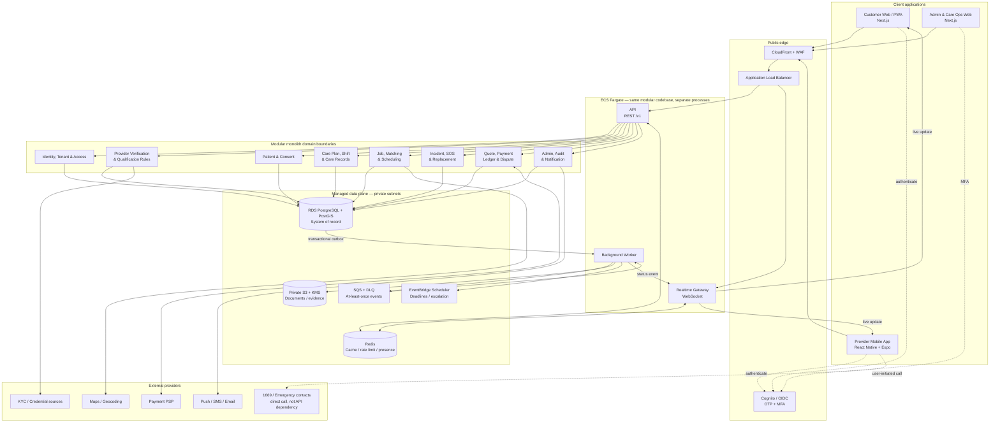
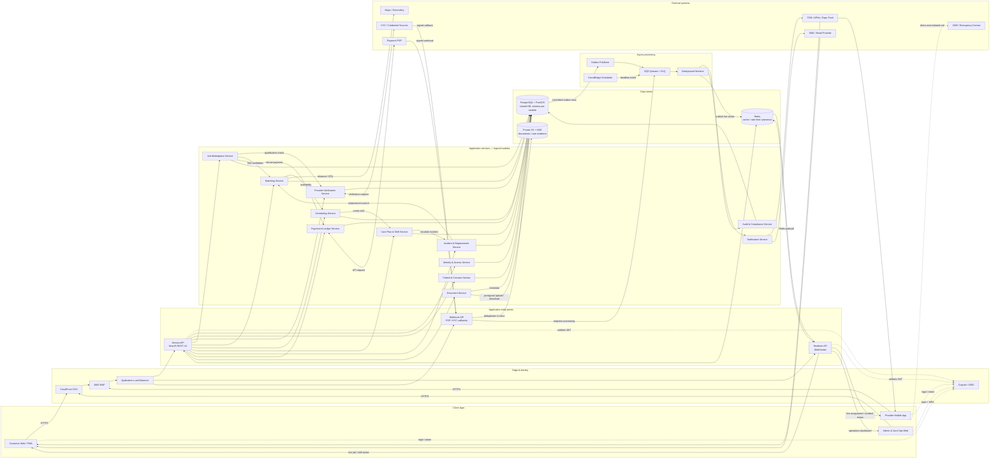
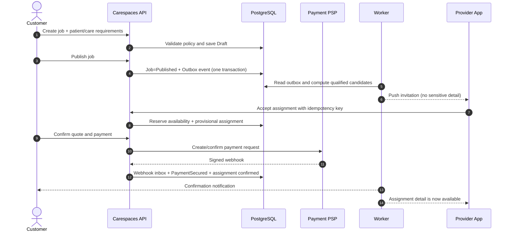

# Carespaces — Tech Stack & Architecture Design (P01)

> สถานะ: Proposed design สำหรับ MVP  
> อ้างอิง: `idea.md` ณ วันที่ 13 กรกฎาคม 2026  
> เป้าหมาย: B2C marketplace งานดูแลรายกะ/รายวันในกรุงเทพฯ โดยรองรับ B2B และงานระยะยาวในอนาคต

## 1. Executive summary

แนวคิดใน `idea.md` มี product loop ที่แข็งแรง: **verified provider → qualification-based matching → care execution → evidence/report → payment/reputation → replacement** จุดต่างสำคัญไม่ใช่เพียง marketplace แต่คือความต่อเนื่องและตรวจสอบย้อนหลังได้ของการดูแล

สถาปัตยกรรมที่แนะนำสำหรับ MVP คือ **modular monolith แบบ event-driven** ไม่ใช่ microservices ตั้งแต่วันแรก โดยใช้ codebase และฐานข้อมูลหลักร่วมกัน แต่แยก module boundary, background worker และ real-time process ชัดเจน วิธีนี้ลดต้นทุนการพัฒนาและ operation ขณะยังสามารถแยกเป็น service ภายหลังได้

ข้อเสนอหลัก:

- Customer/Admin ใช้เว็บ Next.js; Provider ใช้ React Native + Expo เพราะต้องใช้กล้อง, location, push notification และ offline queue
- Backend ใช้ NestJS/TypeScript แบ่ง domain modules และ expose REST API + WebSocket
- PostgreSQL + PostGIS เป็น system of record; ไม่เพิ่ม Elasticsearch หรือ NoSQL ใน MVP
- งาน async ใช้ Transactional Outbox + SQS/DLQ; Redis ใช้เฉพาะ cache, rate limit, short-lived lock และ real-time fan-out
- Deploy บน AWS Region Thailand (`ap-southeast-7`) หาก service ที่ต้องใช้ผ่าน availability check; วาง workload ข้าม AZ
- ข้อมูลสุขภาพ, เอกสารยืนยันตัวตน และข้อมูลการเงินต้องแยกสิทธิ์, เข้ารหัส, audit และกำหนด retention ตั้งแต่ต้น
- Payment ใช้ PSP ผ่าน adapter + internal double-entry ledger; ห้ามเรียก flow ว่า “escrow” ทางกฎหมายจนกว่าจะผ่าน legal/PSP review

## 2. Review ของ `idea.md`

### จุดแข็ง

1. **Value proposition ชัด** — “คนที่เหมาะสม + ติดตามได้ + ไม่ขาดช่วง” แก้ pain ที่ marketplace ทั่วไปไม่ครอบคลุม
2. **Safety ถูกวางใน product flow** — verification, skill matrix, clinical review และ restricted activities ไม่ได้เป็นเพียง badge บนโปรไฟล์
3. **Care Plan versioning ถูกต้อง** — ทำให้ทุก shift อ้างอิงคำสั่งชุดเดียวกันและ audit ได้
4. **Real-time มีขอบเขตเหมาะสม** — เก็บ location ตาม event แทน continuous tracking ลด privacy และ battery risk
5. **Human-in-the-loop เป็นส่วนหนึ่งของระบบ** — complex case, urgent matching, dispute และ replacement ไม่ถูกสมมติว่า automate ได้ทั้งหมด
6. **MVP scope มีวินัย** — ตัด AI diagnosis, telemedicine, wearable และ integration หนักออกอย่างเหมาะสม

### ช่องว่างที่ต้องล็อกก่อน build

| ประเด็น | ผลกระทบต่อระบบ | ข้อเสนอสำหรับ MVP |
|---|---|---|
| Business/legal model | สัญญา, liability, payment, tax | เริ่มเป็น managed marketplace; ให้ฝ่ายกฎหมายยืนยันสถานะนายหน้า/ผู้ให้บริการ |
| “Escrow” | อาจเป็นบริการที่ถูกกำกับ | ใช้คำว่า payment hold/release ตาม capability ของ PSP จน legal review เสร็จ |
| Clinical governance | ใครอนุมัติ task/incident และ SLA | ตั้ง clinical policy owner และ versioned activity policy |
| Consent/authority | ผู้จ้างอาจไม่ใช่ผู้ป่วย | เก็บ legal basis, relationship, consent/authorization และ expiry |
| 24/7 operation | SOS/replacement promise ขึ้นกับคน | เปิดเฉพาะช่วงที่มี staffing; แสดง SLA ตามพื้นที่/เวลาอย่างตรงไปตรงมา |
| Price ownership | กระทบ quote, overtime, refund | ระบบสร้าง price quote จาก rate card; provider ไม่แก้ราคาหลัง accept |
| Long-term job | scheduling/payment ซับซ้อน | ยังไม่รวม recurring contract; model เป็นหลาย shift ภายใต้ booking เดียวใน phase ถัดไป |
| Anti-circumvention | กระทบ retention และ UX | ตัดสินใจเชิงนโยบาย ไม่ควรแก้ด้วยการซ่อนข้อมูลจนกระทบ emergency contact |

### Product boundary ที่ควรประกาศชัด

- Carespaces เป็นระบบประสานงาน บันทึก และแจ้งเหตุ ไม่ใช่บริการแพทย์ฉุกเฉิน
- ปุ่ม SOS ต้องทำให้การโทร `1669` และ emergency contact ทำได้โดยตรง แม้ backend บางส่วนขัดข้อง
- Matching score เป็น decision support; qualification gate และ suspension rule เป็น hard constraint
- Push notification/WebSocket ไม่ใช่หลักฐานว่าผู้รับเห็นข้อความ ต้องมี acknowledgement และ escalation timer สำหรับเหตุสำคัญ

## 3. Architecture principles

1. **Safety before ranking** — filter คนที่ไม่มีสิทธิ์ออกก่อนคำนวณ score เสมอ
2. **Database is the truth** — state สำคัญเปลี่ยนใน PostgreSQL transaction; event และ notification เป็นผลสืบเนื่อง
3. **At-least-once + idempotency** — webhook, job และ consumer ทุกตัวต้องรับ event ซ้ำได้
4. **Explicit state machines** — verification, job, assignment, shift, incident, dispute และ payment มี transition ที่อนุญาตชัดเจน
5. **Least privilege + need-to-know** — role เดียวกันไม่ได้แปลว่าเห็นผู้ป่วยทุกคน; ต้องอยู่ใน care team/assignment/organization ที่เกี่ยวข้อง
6. **Privacy by default** — เก็บ location และ attachment เท่าที่จำเป็น, มี expiry, ไม่ใส่ข้อมูลสุขภาพใน notification body/log/analytics
7. **Human override with audit** — เจ้าหน้าที่ override ได้เฉพาะสิทธิ์ที่กำหนด พร้อม reason, timestamp และ audit trail
8. **Build for extraction, not distribution** — แยก module/API/event contract ให้ดี แต่ยังไม่แยก database/service จนมีเหตุผลด้าน scale หรือทีม

## 4. Recommended tech stack

| Layer | Technology | เหตุผล/ขอบเขต |
|---|---|---|
| Monorepo | pnpm workspaces + Turborepo | แชร์ type, validation, UI token และ API client โดยยังแยก deployable app |
| Customer web | Next.js App Router + TypeScript | responsive web/PWA, SEO สำหรับหน้า public, server rendering และ authenticated portal |
| Admin web | Next.js App Router + TypeScript | deploy แยก customer web, บังคับ MFA และ network/access policy ที่เข้มกว่า |
| Provider app | React Native + Expo | camera, foreground location, secure token storage, push notification และ OTA workflow; ใช้ development build ไม่พึ่ง Expo Go ใน production |
| UI | Tailwind CSS + shared design tokens; React Hook Form + Zod | form จำนวนมาก, validation schema แชร์กับ API contract ได้บางส่วน |
| API | NestJS + TypeScript + REST `/v1` + OpenAPI | module/guard/interceptor ชัด, เหมาะกับ workflow-heavy backend; ใช้ WebSocket เฉพาะ active live view |
| ORM/migrations | Prisma หรือ Drizzle (เลือกหนึ่งหลัง spike) + SQL migration | developer speed แต่อนุญาต raw SQL สำหรับ PostGIS, RLS และ query สำคัญ; migration ต้อง review |
| Primary database | Amazon RDS for PostgreSQL + PostGIS, Multi-AZ | transaction, relational integrity, geospatial search, JSONB เฉพาะข้อมูลยืดหยุ่น และ Row-Level Security เป็น defense-in-depth |
| Cache/realtime | Amazon ElastiCache for Redis | cache, rate limit, presence, short TTL lock และ WebSocket fan-out; ไม่เป็น source of truth |
| Async | Transactional Outbox + Amazon SQS + DLQ; EventBridge Scheduler สำหรับ deadline | ไม่ทำ event หายระหว่าง DB commit กับ publish; รองรับ retry และ delayed workflow |
| Object storage | Private Amazon S3 + KMS + presigned URL + malware scan | credential, care photo และ dispute evidence ไม่ผ่าน app server โดยตรง; deny public access |
| Identity | Amazon Cognito หรือ OIDC provider ผ่าน adapter | OTP/social/enterprise federation ในอนาคต; authorization ยังอยู่ใน application domain |
| Notifications | Expo Push/FCM/APNs + SMS/email provider adapters | push เป็น fast path; critical alert มี fallback/escalation และ delivery status |
| Payment | Thai-capable PSP ผ่าน `PaymentProvider` adapter + webhook inbox | ลด PCI scope, เปลี่ยนผู้ให้บริการได้ และแยก payment state จาก business state |
| Cloud/runtime | AWS Thailand Region; CloudFront + WAF + ALB + ECS Fargate | managed container, scale API/worker/realtime แยกกัน โดยไม่รับภาระ Kubernetes |
| IaC/CI | Terraform + GitHub Actions + OIDC to AWS | reproducible environment, short-lived CI credentials, plan/apply แยก approval |
| Observability | OpenTelemetry + CloudWatch logs/metrics/traces + alerting | correlation ID ข้าม API/worker โดย redact PII/health data ก่อนส่ง telemetry |
| Product analytics | privacy-reviewed event schema | เก็บ business event ที่ไม่มีรายละเอียดสุขภาพ; analytics ID แยกจาก patient ID |

### สิ่งที่ยังไม่ควรเพิ่มใน MVP

- Kubernetes/EKS, service mesh และ microservices
- Kafka/MSK — SQS + outbox เพียงพอสำหรับ workload ระยะแรก
- Elasticsearch/OpenSearch — ใช้ PostgreSQL/PostGIS + indexed filters ก่อน
- GraphQL — REST/OpenAPI ตรงกับ command-heavy workflow และ audit ง่ายกว่า
- Data warehouse/streaming pipeline เต็มรูปแบบ — เริ่มจาก sanitized operational metrics
- AI matching — เริ่มจาก deterministic hard filter + explainable weighted score

## 5. System architecture diagram



สิ่งสำคัญที่ diagram แสดงคือ API, realtime และ worker scale แยกกันได้ แต่ยังใช้ domain code และ transactional model ชุดเดียวกัน ส่วน external provider ทุกตัวอยู่หลัง adapter และเปลี่ยนได้โดยไม่กระทบ core domain

### 5.1 Detailed service connectivity

Diagram นี้แสดงเส้นทางเชื่อมต่อจริงระดับ service โดยกล่องใน `Application services` เป็น **logical module ภายใน modular monolith สำหรับ MVP** ไม่ใช่ microservice ที่ deploy แยกทุกกล่อง ส่วน API, realtime gateway และ worker เป็น process ที่ deploy/scale แยกกันได้



เส้นทางหลักที่ต้องรักษาไว้:

```text
Customer Web  → CloudFront/WAF → Service API → Application Service → PostgreSQL
Provider App  → WAF/ALB       → Service API → Care/Shift Service → PostgreSQL
Provider App  ↔ WAF/ALB       ↔ Realtime API ↔ Redis
Admin Web     → CloudFront/WAF → Service API → Admin-authorized Service → PostgreSQL
Database      → Outbox         → SQS → Worker → Notification/Realtime/External Provider
Payment PSP   → Webhook API    → Inbox + PostgreSQL → SQS → Payment Worker
Mobile Upload → Document API   → Presigned URL → Private S3
```

ข้อกำหนดสำคัญคือ Web/Mobile ห้ามเชื่อม database, Redis, S3 หรือ external provider โดยตรง ยกเว้นการ upload/download ผ่าน S3 presigned URL และการโทร emergency ที่ผู้ใช้เป็นผู้เริ่มเอง

## 6. Backend module boundaries

| Module | Owns | Events สำคัญ |
|---|---|---|
| Identity & Tenant | user, organization, membership, role, device, session | `UserVerified`, `MembershipChanged` |
| Provider Verification | profile, credential, certificate, skill, review decision, expiry | `ProviderApproved`, `CredentialExpiring`, `ProviderSuspended` |
| Patient & Consent | patient, contact, relationship, consent, access grant | `ConsentGranted`, `ConsentRevoked` |
| Care Plan | immutable plan version, task template, medication instruction | `CarePlanPublished`, `CarePlanSuperseded` |
| Marketplace | job, requirement, quote, application, shortlist | `JobPublished`, `ApplicationSubmitted` |
| Matching | qualification gate, distance, availability, explainable score | `CandidatesRanked`, `UrgentBroadcastRequested` |
| Scheduling | assignment, shift, availability reservation | `AssignmentConfirmed`, `ShiftStartingSoon` |
| Care Execution | check-in/out, checkpoint, vital, medication confirmation, handoff | `ShiftCheckedIn`, `CheckpointCompleted`, `HandoffSubmitted` |
| Incident & SOS | incident timeline, acknowledgement, escalation | `IncidentReported`, `IncidentEscalated`, `IncidentClosed` |
| Replacement | request, candidate wave, incentive, SLA timer | `ReplacementRequested`, `ReplacementAssigned`, `ReplacementFailed` |
| Payment & Ledger | quote, authorization/charge, refund, payout, immutable ledger entry | `PaymentSecured`, `ReleaseEligible`, `PayoutRequested` |
| Dispute & Review | case, evidence, decision, review, score inputs | `DisputeOpened`, `DisputeResolved`, `ReviewSubmitted` |
| Notification | template, preference, delivery, acknowledgement | `NotificationSent`, `CriticalAlertAcknowledged` |
| Audit & Compliance | append-only audit, retention job, access report | `SensitiveRecordAccessed`, `RetentionDue` |

กฎ dependency: module อื่นอ้างอิงกันผ่าน public application service หรือ event เท่านั้น ห้าม query table ของอีก module โดยตรงจาก business code แม้ยังอยู่ database เดียวกัน

## 7. Critical workflow design

### 7.1 Normal booking and payment



Concurrency rule: การ accept งานต้อง lock `job_id + shift_id` ใน database transaction และมี unique constraint ป้องกัน double assignment ไม่พึ่ง distributed lock เพียงอย่างเดียว

### 7.2 Shift execution

- Provider download “shift packet” ที่จำเป็นก่อนเริ่มงาน: patient display name, address, contact, care-plan version และ checklist
- Offline queue อนุญาตเฉพาะ checkpoint ที่ timestamp ได้; payment, assignment accept, incident acknowledgement และ care-plan edit ต้อง online
- Check-in บันทึก server timestamp + device timestamp + location snapshot + accuracy + permission status; geofence เป็น signal ไม่ใช่ข้อสรุปการทุจริต
- ทุก checkpoint มี `client_event_id` เพื่อ deduplicate เมื่อ sync ซ้ำ
- หลัง publish แล้ว Care Plan version แก้ไม่ได้; การแก้สร้าง version ใหม่และ shift ที่เริ่มแล้วไม่เปลี่ยน version อัตโนมัติ

### 7.3 Urgent, replacement และ SOS

- Urgent matching ใช้ qualification gate → availability → distance/ETA → trust/reliability → broadcast เป็น wave; ไม่ broadcast ข้อมูลสุขภาพเต็มชุด
- Replacement เป็น saga ที่มี deadline: open request → reserve candidate → confirm → handover → close; failure ทุกขั้นสร้าง task ให้ care coordinator
- SOS UI ต้องมี direct-call actions ก่อน network workflow; backend สร้าง incident, ส่ง location snapshot, แจ้ง ops และเริ่ม acknowledgement timer
- หาก critical notification ไม่ถูก acknowledge ต้อง fallback channel และสร้าง ops task; “ส่ง push สำเร็จ” ไม่เท่ากับ “รับทราบแล้ว”

## 8. Data model adjustments

Entity ใน `idea.md` ครอบคลุม core domain ดีแล้ว แต่ควรเพิ่ม entity ต่อไปนี้ก่อนสร้าง schema:

- Multi-tenancy/access: `Tenant`, `OrganizationMembership`, `RoleAssignment`, `PatientAccessGrant`, `CareTeamMember`
- Privacy: `ConsentRecord`, `LegalBasisRecord`, `DataSubjectRequest`, `RetentionPolicy`, `SensitiveAccessLog`
- Workflow: `StateTransition`, `IdempotencyKey`, `InboxMessage`, `OutboxEvent`, `ScheduledDeadline`
- Pricing/finance: `PriceQuote`, `QuoteLineItem`, `LedgerAccount`, `LedgerTransaction`, `LedgerEntry`, `WebhookEvent`, `PaymentAttempt`
- Mobile/realtime: `Device`, `PushToken`, `SyncCursor`, `ClientEvent`, `NotificationDelivery`, `Acknowledgement`
- Verification: `VerificationCase`, `VerificationDecision`, `CredentialCheck`, `CredentialExpiryAction`
- Operations: `OpsTask`, `Escalation`, `SlaClock`, `ManualOverride`

### Data modeling rules

- ใช้ UUIDv7/ULID สำหรับ public ID; แยก internal surrogate key ได้ถ้าจำเป็น
- ทุก tenant-owned row มี `tenant_id`; B2C ใช้ personal/family tenant, B2B ใช้ organization tenant
- เงินเก็บเป็น integer minor unit + currency ห้ามใช้ floating point
- เวลาเก็บเป็น UTC พร้อม timezone ของสถานที่/shift; ห้าม derive payroll จาก local string
- status ใช้ constrained transition table/service ไม่ให้ update enum โดยตรง
- clinical record ใช้ append/correct pattern: ไม่ลบหรือ overwrite ข้อมูลเดิมโดยไร้ร่องรอย
- attachment metadata อยู่ DB แต่ binary อยู่ private S3; access ผ่าน short-lived signed URL และ authorization ทุกครั้ง
- ที่อยู่/พิกัด exact เปิดให้ provider หลัง assignment confirmed เท่านั้น; matching ใช้ geohash/พิกัดที่ลดความละเอียดเมื่อทำได้

## 9. Authorization and security model

### Authorization

ใช้ **RBAC + ABAC**:

- RBAC กำหนด capability ระดับ role เช่น `verification.review`, `incident.manage`, `payout.approve`
- ABAC ตรวจ relationship/assignment/tenant/patient access/shift time และ data sensitivity
- PostgreSQL Row-Level Security ใช้เป็น defense-in-depth สำหรับ tenant/patient-scoped table ไม่ใช่แทน application authorization
- Admin ที่เข้าถึงข้อมูลสุขภาพต้อง MFA; privileged action ใช้ step-up authentication
- Break-glass access ต้องใส่เหตุผล, มีอายุสั้น, แจ้ง security/compliance และถูก review ภายหลัง
- Finance role ไม่เห็น clinical note; clinical role ไม่แก้ ledger; support เห็นข้อมูลแบบ masked ตามงานที่รับผิดชอบ

### Data protection baseline

- TLS ทุก connection; RDS/S3/Redis/queue และ backup เข้ารหัสด้วย KMS
- แยก KMS key อย่างน้อย `clinical`, `identity-documents`, `finance`, `backup`
- เลขบัตรประชาชน/เลขใบประกอบวิชาชีพเก็บแบบ application-level envelope encryption; search ด้วย keyed hash เฉพาะ field ที่ต้อง exact match
- Password/OTP secret ไม่เก็บใน application DB หากใช้ managed IdP
- Log, trace, error report และ analytics ห้ามมี patient name, diagnosis, medication, document URL หรือ auth token
- Upload ผ่าน quarantine prefix → type/size validation → malware scan → promote ไป clean prefix
- Secret อยู่ Secrets Manager; CI ใช้ OIDC และ short-lived role ไม่เก็บ long-lived AWS key
- Audit event เป็น append-only และส่งสำเนาไป storage ที่จำกัดสิทธิ์แก้ไข

ข้อมูลสุขภาพเป็นข้อมูลอ่อนไหว จึงต้องให้ฝ่ายกฎหมาย/DPO ระบุฐานการประมวลผล, notice, consent/exception, retention, processor agreement และ cross-border transfer ก่อน production เอกสารนี้เป็น technical design ไม่ใช่คำวินิจฉัยทางกฎหมาย

## 10. Matching engine v1

Matching แยกเป็นสองชั้นเพื่อให้ปลอดภัยและอธิบายได้:

### Hard qualification gate

ผู้สมัครต้องผ่านทุกข้อ:

- provider status ใช้งานได้และ credential ไม่หมดอายุ ณ เวลา shift
- provider type/skill/certificate ตรงกับ job requirement
- restricted activity ไม่ขัดกับ role/policy version
- availability ไม่ชน assignment ที่ confirmed/reserved
- service area/distance ผ่านเกณฑ์
- ไม่มี suspension/block ระหว่างคู่ผู้ว่าจ้าง–provider
- complex/risk case มี clinical approval ตาม policy

### Explainable ranking

ตัวอย่างน้ำหนักเริ่มต้น (ต้อง calibrate จากข้อมูลจริง): qualification fit, relevant experience, ETA/distance, reliability, continuity with patient, price fit และ response likelihood ทุก candidate result เก็บ `policy_version`, feature snapshot และ reason codes เช่น `SKILL_MATCH`, `PREVIOUS_PATIENT_CONTINUITY` โดยไม่เปิด internal risk score ทั้งหมดแก่ผู้ใช้

ห้ามใช้ incident rate ดิบโดยไม่ปรับตามจำนวน/ความยากของเคส เพราะจะสร้างแรงจูงใจไม่ให้รายงาน incident

## 11. Payment architecture

- PSP เป็นเจ้าของ card/payment credential; Carespaces เก็บเพียง provider reference/token
- `Payment`, `Refund`, `Payout` เป็น orchestration state; `LedgerEntry` เป็นประวัติการเงินที่แก้ไม่ได้
- ทุก webhook ตรวจ signature, เก็บ raw body แบบเข้ารหัส, deduplicate ด้วย provider event ID และตอบเร็ว ก่อน process แบบ async
- API command ด้านการเงินต้องรับ `Idempotency-Key`
- Release eligibility คำนวณจาก shift completion + approval/dispute window แต่ payout สำเร็จเมื่อ PSP webhook ยืนยันเท่านั้น
- Ledger transaction ต้อง balance ทุกครั้ง; correction ใช้ reversing entry ไม่แก้ยอดเดิม
- Reconcile ledger กับ PSP settlement report รายวัน และสร้าง ops task เมื่อไม่ตรง
- แยก maker/checker สำหรับ manual refund/payout เกิน threshold

ก่อน launch ต้องยืนยันกับ PSP/ฝ่ายกฎหมายว่า payment hold, split, payout, refund, KYC ผู้รับเงิน และภาษีรองรับ business model จริง คำว่า “escrow” ไม่ควรปรากฏใน UX/สัญญาจนได้รับการยืนยัน

## 12. Deployment topology

```text
Production account
├── Public: CloudFront, WAF, ALB
├── Private application subnets (อย่างน้อย 2 AZ)
│   ├── ECS API service
│   ├── ECS realtime service
│   └── ECS worker service
├── Isolated data subnets
│   ├── RDS PostgreSQL Multi-AZ
│   └── ElastiCache Redis Multi-AZ
├── Regional managed services: S3, SQS, EventBridge, KMS, Secrets Manager
└── Security/operations: CloudTrail, GuardDuty, CloudWatch, AWS Backup

Separate non-production account
└── dev / preview / staging (ใช้ synthetic data เท่านั้น)
```

เลือก AWS Thailand Region เป็นค่าเริ่มต้นเพื่อลด latency และช่วยเรื่อง data residency แต่ Region นี้เป็น opt-in และ service ใหม่อาจไม่ครบเท่า Singapore จึงต้องทำ **region capability spike** ก่อนล็อก architecture หาก service สำคัญไม่พร้อม ให้เสนอ fallback เป็น Singapore พร้อม legal/data-transfer review แทนการกระจาย production dataสอง Region ตั้งแต่ MVP

## 13. Reliability and non-functional requirements

| Area | MVP target |
|---|---|
| Availability | 99.9% ต่อเดือนสำหรับ booking/care API; ไม่โฆษณา SOS เป็น emergency-service SLA |
| API latency | p95 < 500 ms สำหรับ command/query ทั่วไป; matching p95 < 2 s ที่ candidate pool เป้าหมาย |
| Live status | update ถึง active client ภายใน 3 s ตามปกติ; push เป็น fallback ไม่ใช่ guarantee |
| RPO / RTO | RPO ≤ 15 นาที, RTO ≤ 2 ชั่วโมง; ทดสอบ restore อย่างน้อยรายไตรมาส |
| Durability | financial/clinical state commit ใน PostgreSQL ก่อน acknowledge; event ผ่าน outbox |
| Scale assumption | เริ่มออกแบบที่ 10k registered users, 1k concurrent sessions, 100 active shifts; load test ก่อน launch |
| Offline | provider อ่าน shift packet/checklist และ queue checkpoint ได้ชั่วคราว; conflict แสดงให้ผู้ใช้ทราบ |
| Audit | privileged read/write, state transition, export และ manual override trace ถึง actor/reason/correlation ID |

### Failure handling ที่ต้องทดสอบ

- PSP webhook มาซ้ำ/มาผิดลำดับ/มาช้า
- provider สองคน accept urgent job พร้อมกัน
- app offline ระหว่าง check-in หรือ submit checkpoint
- credential หมดอายุหลัง accept แต่ก่อนเริ่ม shift
- Care Plan มี version ใหม่ระหว่าง shift
- push ส่งไม่ถึงและไม่มี acknowledgement
- worker crash หลัง side effect แต่ก่อน mark message complete
- replacement สำเร็จหลัง original provider กลับมายืนยัน
- database failover, Redis loss และ queue redrive จาก DLQ

## 14. Repository shape

```text
carespaces/
├── apps/
│   ├── customer-web/
│   ├── admin-web/
│   ├── provider-mobile/
│   ├── api/
│   └── worker/
├── packages/
│   ├── api-contracts/
│   ├── domain-events/
│   ├── validation/
│   ├── authz/
│   ├── observability/
│   ├── ui-web/
│   └── config/
├── infrastructure/
│   ├── modules/
│   └── environments/
├── docs/
│   ├── adr/
│   ├── threat-model/
│   └── runbooks/
└── tests/
    ├── contract/
    ├── e2e/
    └── load/
```

ไม่ควรแชร์ database model เข้า frontend โดยตรง ให้ generate typed client จาก OpenAPI และแยก public DTO ออกจาก persistence model

## 15. Delivery plan

### Phase 0 — Decisions and risk spikes (2–3 สัปดาห์)

- ยืนยัน business/legal model, payment flow, clinical policy owner และ operating hours
- spike PSP: hold/release, split/payout, refund, webhook, recipient KYC และ reconciliation
- spike AWS Thailand service availability/cost และ mobile location/push บนอุปกรณ์ Android ที่พบมากในตลาด
- ทำ threat model + data inventory + consent/retention matrix
- ล็อก state machines และ permission matrix ก่อนออกแบบหน้าจอ

### Phase 1 — Foundation (3–4 สัปดาห์)

- monorepo, CI/CD, Terraform, dev/staging/prod accounts
- identity, tenant, RBAC/ABAC, audit, upload quarantine, notification adapter
- database migration discipline, outbox/inbox/idempotency, observability และ runbooks

### Phase 2 — Marketplace core (5–7 สัปดาห์)

- provider onboarding/verification/availability
- patient + consent, job + requirement, deterministic matching, quote/payment
- customer/admin web และ provider mobile happy path

### Phase 3 — Care operations (5–7 สัปดาห์)

- versioned Care Plan, shift packet, check-in/out, checkpoint offline sync, handoff
- incident/SOS, live status, dispute, review, replacement saga
- reconciliation, credential expiry และ admin ops queue

### Phase 4 — Hardening and pilot (3–4 สัปดาห์)

- penetration test, restore/DR drill, load/concurrency test, DLQ/replay exercise
- clinical workflow simulation และ tabletop incident drill
- pilot เขตจำกัด + operating hours จำกัด; วัด fill rate, time-to-match, cancellation, replacement success และ report completion

## 16. Decisions required before implementation

| ID | Decision | Recommended default | Owner |
|---|---|---|---|
| D-01 | Marketplace vs managed service | Managed marketplace with human care ops | Founder + Legal |
| D-02 | Launch area | กรุงเทพฯ เขตที่มี provider density สูงก่อน | Product + Ops |
| D-03 | Provider approval | Approved only; ยังไม่ให้ conditional รับงาน | Clinical + Ops |
| D-04 | Pricing | Platform-generated quote จาก versioned rate card | Product + Finance |
| D-05 | Payment semantics | PSP-supported hold/release; ห้ามใช้คำว่า escrow ก่อน review | Legal + Finance |
| D-06 | SOS/replacement hours | แสดงเฉพาะ SLA ที่ทีม staff ได้จริง | Ops |
| D-07 | Customer app | Responsive web/PWA ก่อน; provider เป็น native mobile | Product + Engineering |
| D-08 | Cloud region | Thailand ถ้า capability spike ผ่าน | Engineering + DPO |
| D-09 | ORM | Prisma vs Drizzle หลังทดสอบ PostGIS/RLS/migration | Engineering |
| D-10 | Long-term jobs | เลื่อนไป phase หลัง pilot | Product |

## 17. Architecture decision records ที่ควรสร้างต่อ

1. ADR-001: Modular monolith vs microservices
2. ADR-002: AWS Region และ data residency
3. ADR-003: Identity provider และ tenant model
4. ADR-004: Payment/ledger/reconciliation model
5. ADR-005: Offline sync conflict policy
6. ADR-006: Care Plan immutability/versioning
7. ADR-007: Authorization, break-glass และ audit
8. ADR-008: Notification acknowledgement/escalation

## 18. References

- [Next.js App Router documentation](https://nextjs.org/docs/app) — แนวทาง App Router และ server/client component
- [NestJS WebSocket gateways](https://docs.nestjs.com/websockets/gateways) — real-time gateway สำหรับ active session
- [Expo Location](https://docs.expo.dev/versions/latest/sdk/location/) — location API และข้อจำกัด background behavior
- [Expo data storage guidance](https://docs.expo.dev/develop/user-interface/store-data/) — SecureStore/SQLite และชนิดข้อมูลที่เหมาะกับแต่ละ storage
- [Expo push notifications overview](https://docs.expo.dev/push-notifications/overview/) — abstraction เหนือ FCM/APNs
- [PostgreSQL Row Security Policies](https://www.postgresql.org/docs/17/ddl-rowsecurity.html) — row-level access control และ default-deny behavior
- [AWS Regions and Availability Zones](https://docs.aws.amazon.com/global-infrastructure/latest/regions/aws-regions.html) — `ap-southeast-7` มี 3 AZ และเป็น opt-in Region
- [Amazon RDS encryption](https://docs.aws.amazon.com/AmazonRDS/latest/UserGuide/Encryption.html) — encryption at rest/in transit และ KMS integration
- [ประกาศการคุ้มครองข้อมูลส่วนบุคคลของระบบหมอพร้อม กระทรวงสาธารณสุข](https://bdh.moph.go.th/site/wp-content/uploads/2024/11/C-1-%E0%B8%9B%E0%B8%A3%E0%B8%B0%E0%B8%81%E0%B8%B2%E0%B8%A3%E0%B8%84%E0%B8%B8%E0%B9%89%E0%B8%A1%E0%B8%84%E0%B8%A3%E0%B8%AD%E0%B8%87%E0%B8%82%E0%B9%89%E0%B8%AD%E0%B8%A1%E0%B8%B9%E0%B8%A5%E0%B8%AA%E0%B9%88%E0%B8%A7%E0%B8%99%E0%B8%9A%E0%B8%B8%E0%B8%84%E0%B8%84%E0%B8%A5%E0%B8%82%E0%B8%AD%E0%B8%87%E0%B8%A3%E0%B8%B0%E0%B8%9A.pdf) — ตัวอย่าง official privacy notice สำหรับระบบข้อมูลสุขภาพในไทย

---

### Recommendation

เริ่ม implementation เมื่อ D-01, D-05, D-06 และ D-08 ถูกตัดสินแล้วเท่านั้น เพราะทั้งสี่ข้อเปลี่ยน liability, payment workflow, availability promise และ infrastructure boundary โดยตรง ส่วน feature อื่นสามารถเดินหน้าด้วย modular monolith ตามแบบนี้ได้โดยไม่ต้องรอการออกแบบ microservices เพิ่ม
